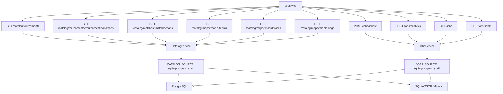

# Схема API

```mermaid
flowchart TD
    UI["apps/web"] --> CAT["GET /catalog/tournaments"]
    UI --> MAT["GET /catalog/tournaments/:tournamentId/matches"]
    UI --> MAP["GET /catalog/matches/:matchId/maps"]
    UI --> TEAM["GET /catalog/maps/:mapId/teams"]
    UI --> TRK["GET /catalog/maps/:mapId/tracks"]
    UI --> RNG["GET /catalog/maps/:mapId/rings"]

    UI --> JOB1["POST /jobs/ingest"]
    UI --> JOB2["POST /jobs/analysis"]
    UI --> JOB3["GET /jobs"]
    UI --> JOB4["GET /jobs/:jobId"]

    CAT --> CATSVC["CatalogService"]
    MAT --> CATSVC
    MAP --> CATSVC
    TEAM --> CATSVC
    TRK --> CATSVC
    RNG --> CATSVC

    JOB1 --> JOBSVC["JobsService"]
    JOB2 --> JOBSVC
    JOB3 --> JOBSVC
    JOB4 --> JOBSVC

    CATSVC --> MODE["CATALOG_SOURCE: sqlite|postgres|hybrid"]
    JOBSVC --> MODE2["JOBS_SOURCE: sqlite|postgres|hybrid"]
    MODE --> PG["PostgreSQL"]
    MODE --> FB["SQLite/JSON fallback"]
    MODE2 --> PG
    MODE2 --> FB
```
