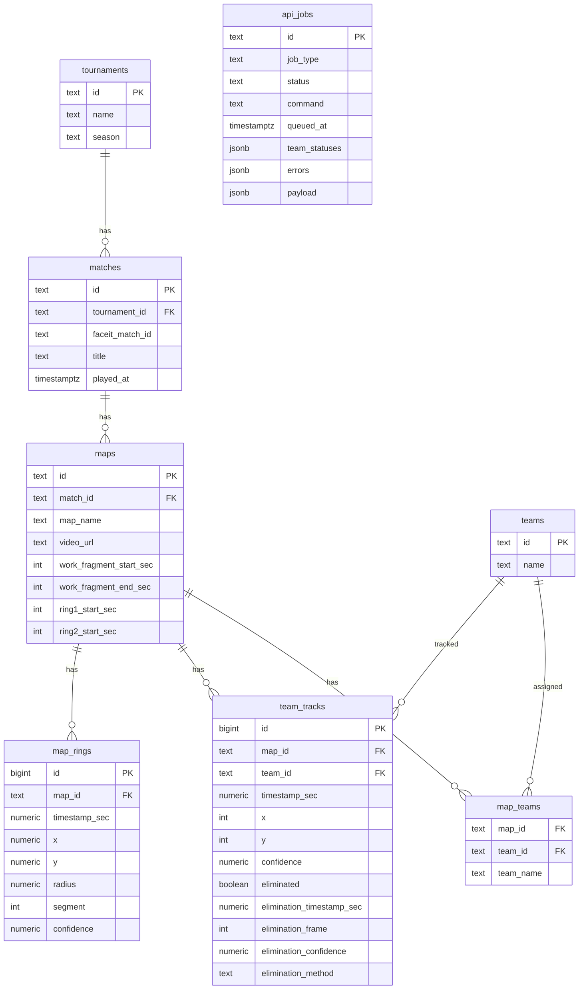

# Схема БД (PostgreSQL)

```mermaid
erDiagram
    tournaments ||--o{ matches : has
    matches ||--o{ maps : has
    maps ||--o{ map_teams : has
    teams ||--o{ map_teams : assigned
    maps ||--o{ team_tracks : has
    teams ||--o{ team_tracks : tracked
    maps ||--o{ map_rings : has

    tournaments {
      text id PK
      text name
      text season
    }
    matches {
      text id PK
      text tournament_id FK
      text faceit_match_id
      text title
      timestamptz played_at
    }
    maps {
      text id PK
      text match_id FK
      text map_name
      text video_url
      int work_fragment_start_sec
      int work_fragment_end_sec
      int ring1_start_sec
      int ring2_start_sec
    }
    teams {
      text id PK
      text name
    }
    map_teams {
      text map_id FK
      text team_id FK
      text team_name
    }
    team_tracks {
      bigint id PK
      text map_id FK
      text team_id FK
      numeric timestamp_sec
      int x
      int y
      numeric confidence
      boolean eliminated
      numeric elimination_timestamp_sec
      int elimination_frame
      numeric elimination_confidence
      text elimination_method
    }
    map_rings {
      bigint id PK
      text map_id FK
      numeric timestamp_sec
      numeric x
      numeric y
      numeric radius
      int segment
      numeric confidence
    }
    api_jobs {
      text id PK
      text job_type
      text status
      text command
      timestamptz queued_at
      jsonb team_statuses
      jsonb errors
      jsonb payload
    }
```
