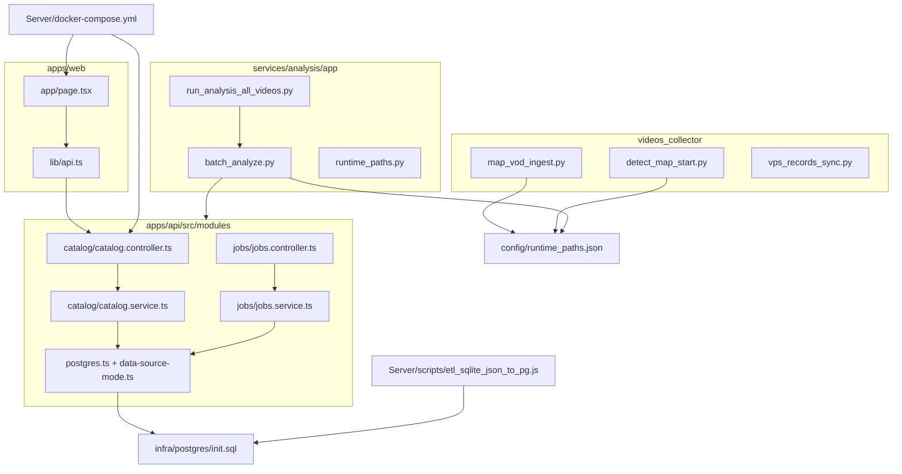

# Подробная схема (с файлами)

```mermaid
flowchart TD
    subgraph Collector["videos_collector"]
      VC1["map_vod_ingest.py"]
      VC2["detect_map_start.py"]
      VC3["vps_records_sync.py"]
    end

    subgraph Analysis["services/analysis/app"]
      AN1["run_analysis_all_videos.py"]
      AN2["batch_analyze.py"]
      AN3["runtime_paths.py"]
    end

    subgraph API["apps/api/src/modules"]
      AP1["catalog/catalog.controller.ts"]
      AP2["catalog/catalog.service.ts"]
      AP3["jobs/jobs.controller.ts"]
      AP4["jobs/jobs.service.ts"]
      AP5["postgres.ts + data-source-mode.ts"]
    end

    subgraph Web["apps/web"]
      WB1["lib/api.ts"]
      WB2["app/page.tsx"]
    end

    CFG["config/runtime_paths.json"]
    PG["infra/postgres/init.sql"]
    SRV["Server/docker-compose.yml"]
    ETL["Server/scripts/etl_sqlite_json_to_pg.js"]

    VC1 --> CFG
    VC2 --> CFG
    AN1 --> AN2
    AN2 --> CFG
    AN2 --> API
    AP1 --> AP2
    AP3 --> AP4
    AP2 --> AP5
    AP4 --> AP5
    AP5 --> PG
    WB1 --> AP1
    WB2 --> WB1
    ETL --> PG
    SRV --> AP1
    SRV --> WB2
```
