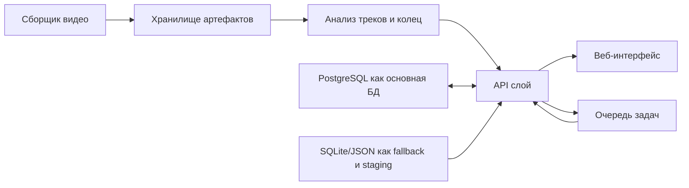

# Простая схема проекта (B -> C)

Кратко:
- `videos_collector` собирает матчи и готовит исходные артефакты.
- `services/analysis` строит треки команд и таймлайн.
- `apps/api` отдает единый контракт данных.
- `apps/web` визуализирует турниры/матчи/карты.
- PostgreSQL — целевой SoT; SQLite/JSON оставлены как fallback.
