# Apex Stats Parser — полный комплект схем для диплома

Ниже собран единый набор схем в формате Mermaid.  
Для каждой схемы даны: цель, как читать, и опора на код.

## 1) Архитектурные схемы

### 1.1 Контекстная схема системы

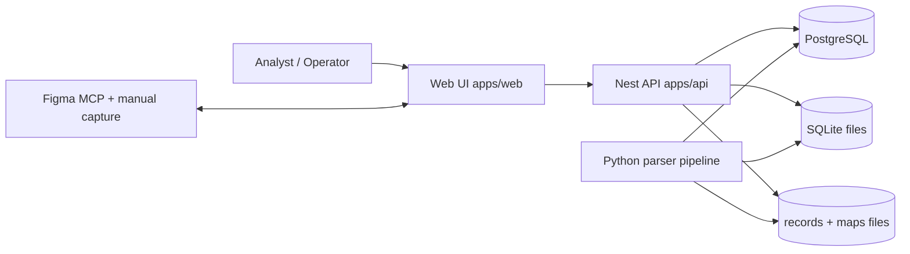

Схема показывает проект как систему вокруг web-клиента и API. Пользователь работает из браузера, а весь доменный доступ идет через `catalog` и соседние API-модули. Данные приходят из двух источников хранения: PostgreSQL (основной путь) и SQLite/JSON (fallback и артефакты). Python-пайплайн формирует входные артефакты треков, колец и видео. Интеграция с Figma используется как внешний контур для переноса интерфейса и ревью дизайна.

Опора на код: `apps/web/app/page.tsx`, `apps/api/src/modules/catalog/catalog.service.ts`.

### 1.2 C4 Container (проектные контейнеры)

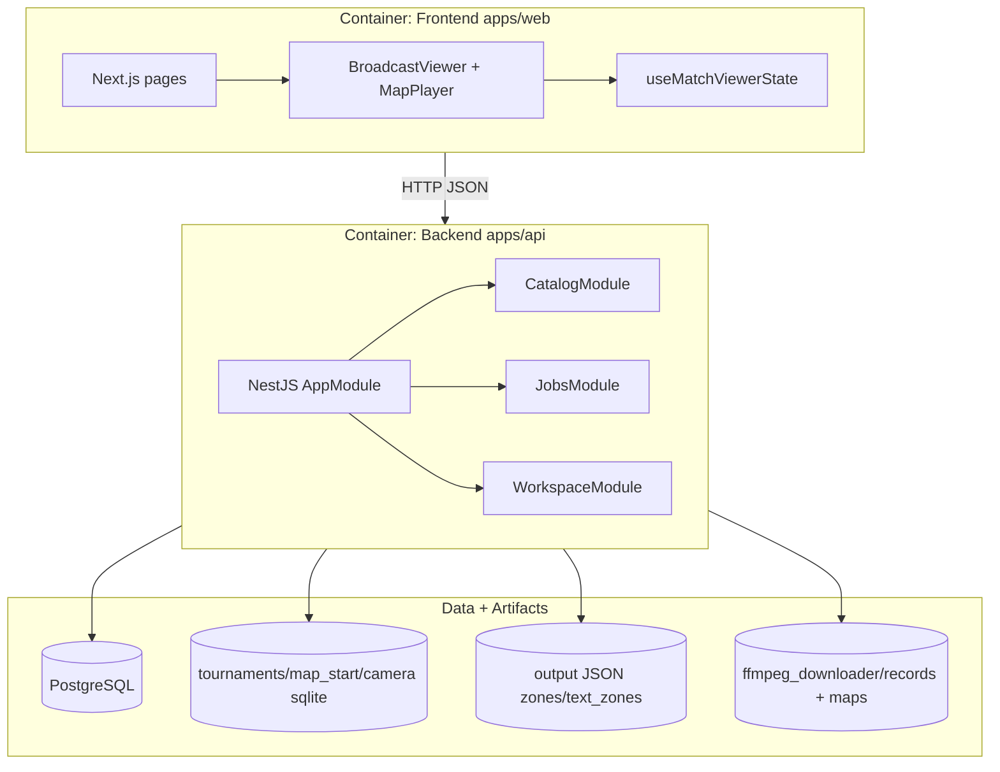

Этот уровень фиксирует крупные контейнеры, которые удобно описывать в главе «Архитектура». Frontend и backend разделены, но связаны только HTTP-контрактами. В backend выделены три модуля, где `CatalogModule` покрывает основную предметную область для просмотра матча и настройки карты. Хранилища вынесены отдельно, чтобы показать смешанный режим источников (`postgres`/`sqlite`/`hybrid`). Это помогает объяснить устойчивость системы к неполной миграции данных.

Опора на код: `apps/api/src/modules/app.module.ts`, `apps/api/src/modules/runtime-paths.ts`.

### 1.3 Компонентная схема frontend

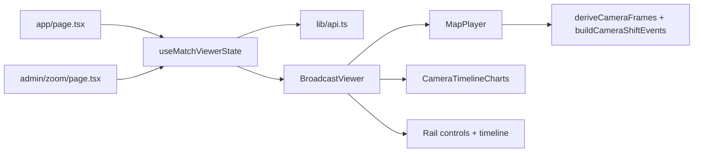

Схема показывает, где находится orchestration состояния и где начинается рендеринг. `useMatchViewerState` является единой точкой, где живут выбор турнира/матча/карты, загрузка API-данных и синхронизация `timeCursor`. `BroadcastViewer` композитно собирает map, видео и графики. `MapPlayer` реализует тяжелую вычислительную часть для отрисовки камеры и командных треков. Такой разрез полезен для раздела «Структура UI-состояния и визуализации».

Опора на код: `apps/web/lib/useMatchViewerState.ts`, `apps/web/components/broadcast/BroadcastViewer.tsx`.

### 1.4 Компонентная схема backend (catalog)

```mermaid
flowchart TB
  ctrl[CatalogController] --> svc[CatalogService]
  svc --> mode[resolveDataSourceMode]
  svc --> pgq[Postgres pool queries]
  svc --> pysql[PythonSqliteDb via spawnSync]
  svc --> files[fs/path runtime artifacts]

  ctrl --> ep1[/catalog/maps/:mapId/tracks]
  ctrl --> ep2[/catalog/maps/:mapId/rings]
  ctrl --> ep3[/catalog/maps/:mapId/camera]
  ctrl --> ep4[/catalog/maps/:mapId/video]
  ctrl --> ep5[/catalog/maps/:mapId/admin-config]
  ctrl --> ep6[/catalog/maps/:mapId/zones,text-zones]
```

Здесь отражены ключевые обязанности `catalog`: маршрутизация запроса, выбор источника данных и нормализация ответа под единый тип фронтенда. Важный момент — backend сочетает SQL-запросы к PostgreSQL с безопасным fallback на SQLite и файловые артефакты. Также в сервисе реализован слой совместимости для старых схем и неполных данных. Это объясняет, почему UI продолжает работать даже при частично заполненной БД.

Опора на код: `apps/api/src/modules/catalog/catalog.controller.ts`, `apps/api/src/modules/catalog/catalog.service.ts`.

## 2) Потоки данных

### 2.1 End-to-end поток (ingest -> parse -> DB -> UI)

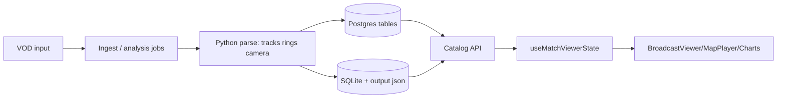

Диаграмма отражает полный жизненный путь данных, что удобно для раздела «Технологический pipeline». Данные из видео сначала обрабатываются внешним пайплайном, затем раскладываются по постоянным источникам. API агрегирует источники и выдает frontend типизированные структуры. Frontend не зависит от конкретного физического источника, он получает уже унифицированный формат. Это критично для масштабирования и плавной миграции стораджа.

Опора на код: `apps/api/src/modules/catalog/catalog.service.ts`, `apps/web/lib/api.ts`.

### 2.2 Runtime-поток для CAMERA-страницы

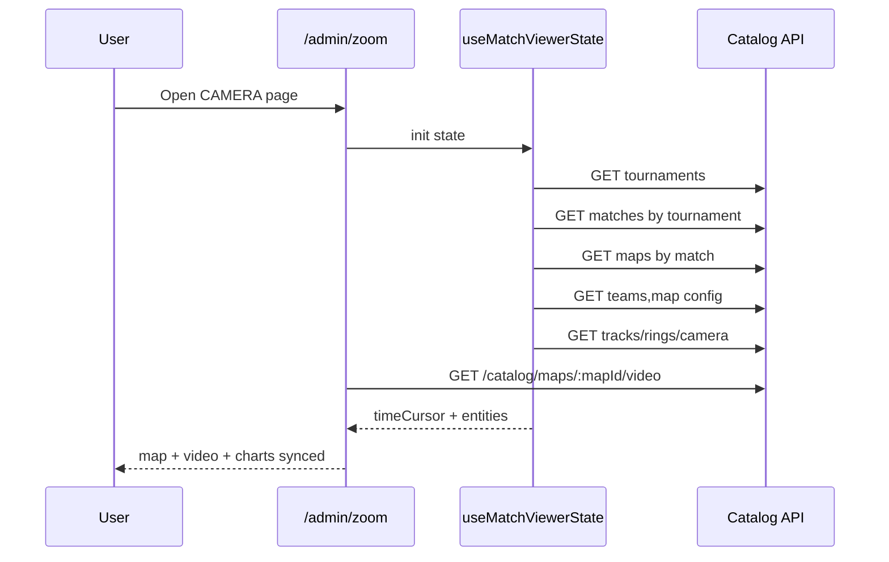

Сценарий фиксирует загрузку именно CAMERA-режима, где есть дополнительный видеоконтур. Инициализация идет каскадом: каталог, затем сущности выбранной карты, затем данные таймлайна. Для видео используется отдельный endpoint карты, что снижает число 404 и ручных привязок путей. После загрузки все виджеты завязаны на единый `timeCursor`. Эта схема хорошо ложится в раздел «Сценарий работы оператора».

Опора на код: `apps/web/app/admin/zoom/page.tsx`, `apps/web/lib/useMatchViewerState.ts`.

### 2.3 Поток обновления timeCursor

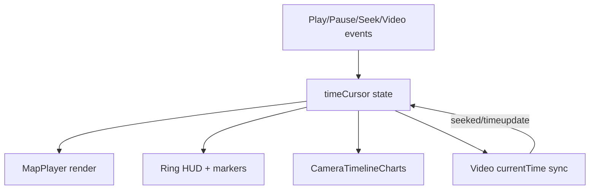

Схема описывает замкнутый цикл синхронизации времени между интерактивными элементами. Источником обновления может быть транспорт-панель или сам видеоплеер. `timeCursor` выступает единым «часовым сигналом» для карты, кольца, графиков и подписи времени. В CAMERA-режиме присутствует обратная связь из видео-событий, поэтому особенно важны анти-дрифт проверки. Это объясняет, почему UI остается согласованным при ручных seek-операциях.

Опора на код: `apps/web/lib/useMatchViewerState.ts`, `apps/web/app/admin/zoom/page.tsx`.

## 3) БД и модель данных

### 3.1 ER-диаграмма доменных сущностей

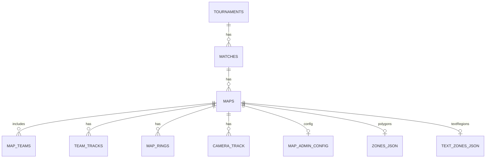

ER-схема показывает основную иерархию «турнир -> матч -> карта» и производные ряды телеметрии. Для диплома важно отдельно подчеркнуть, что часть данных хранится как нормализованные таблицы, а часть как JSON-артефакты per-map. Это архитектурное решение ускоряет эксперименты с зонами/настройками, не ломая основную БД. Также становится ясным, почему frontend запрашивает map-centric endpoint-ы. Такая модель удобна для сценариев пакетной обработки VOD.

Опора на код: `apps/api/src/modules/catalog/catalog.service.ts`, `apps/web/lib/types.ts`.

### 3.2 Логические связи map-centric

```mermaid
flowchart LR
  mapId[mapId key] --> teams[/maps/:mapId/teams]
  mapId --> tracks[/maps/:mapId/tracks]
  mapId --> rings[/maps/:mapId/rings]
  mapId --> camera[/maps/:mapId/camera]
  mapId --> video[/maps/:mapId/video]
  mapId --> cfg[/maps/:mapId/admin-config]
  mapId --> zones[/maps/:mapId/zones]
```

Диаграмма фокусируется на проектном выборе «карта как агрегатный корень». Практически все runtime-запросы и настройки привязаны к `mapId`, благодаря чему логика UI значительно проще. Такой стиль API особенно полезен для страницы CAMERA, где все компоненты должны синхронизироваться в одном временном диапазоне. В тексте диплома это можно подать как bounded context для battle-сессии. Схема также помогает объяснить кэширование на уровне карты.

Опора на код: `apps/api/src/modules/catalog/catalog.controller.ts`, `apps/web/lib/api.ts`.

### 3.3 Жизненный цикл данных

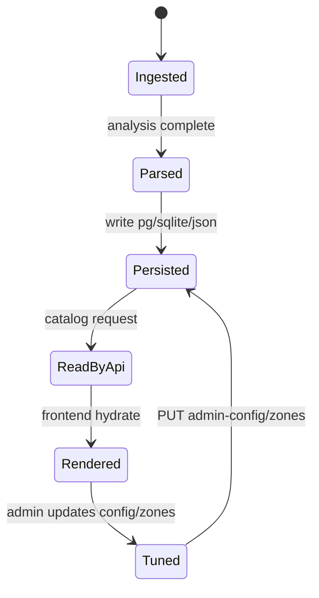

State-диаграмма показывает, что данные не только читаются, но и итеративно уточняются оператором. После первичного парсинга сохраняются и «сырые», и прикладные представления. Далее API выдает данные в UI, где выполняется визуальная валидация. При корректировке зон и параметров изменения возвращаются в артефакты через PUT-endpoint-ы. Таким образом, жизненный цикл поддерживает непрерывный цикл улучшения качества.

Опора на код: `apps/api/src/modules/catalog/catalog.service.ts`, `apps/api/src/modules/catalog/catalog.controller.ts`.

## 4) API и взаимодействия

### 4.1 Карта REST-эндпоинтов

```mermaid
flowchart TB
  subgraph catalog[/catalog]
    t1[GET /tournaments]
    t2[GET /tournaments/:id/matches]
    t3[GET /matches/:id/maps]
    t4[GET /maps/:mapId/teams]
    t5[GET /maps/:mapId/tracks]
    t6[GET /maps/:mapId/rings]
    t7[GET /maps/:mapId/camera]
    t8[GET /maps/:mapId/background]
    t9[GET /maps/:mapId/video]
    t10[GET/PUT /maps/:mapId/admin-config]
    t11[GET/PUT /maps/:mapId/zones]
    t12[GET/PUT /maps/:mapId/text-zones]
    t13[GET /maps/assets]
  end
```

Схема дает компактную навигацию по контрактам, без деталей параметров. Для диплома это удобно как «API inventory» перед sequence-диаграммами. Отдельно видно, что read/write маршруты для админ-настроек локализованы и не смешаны с runtime-телеметрией. Так проще аргументировать модульность и безопасность изменений. В дальнейшем эту карту можно расширить таблицей статусов и SLA.

Опора на код: `apps/api/src/modules/catalog/catalog.controller.ts`.

### 4.2 Sequence: загрузка CAMERA-экрана

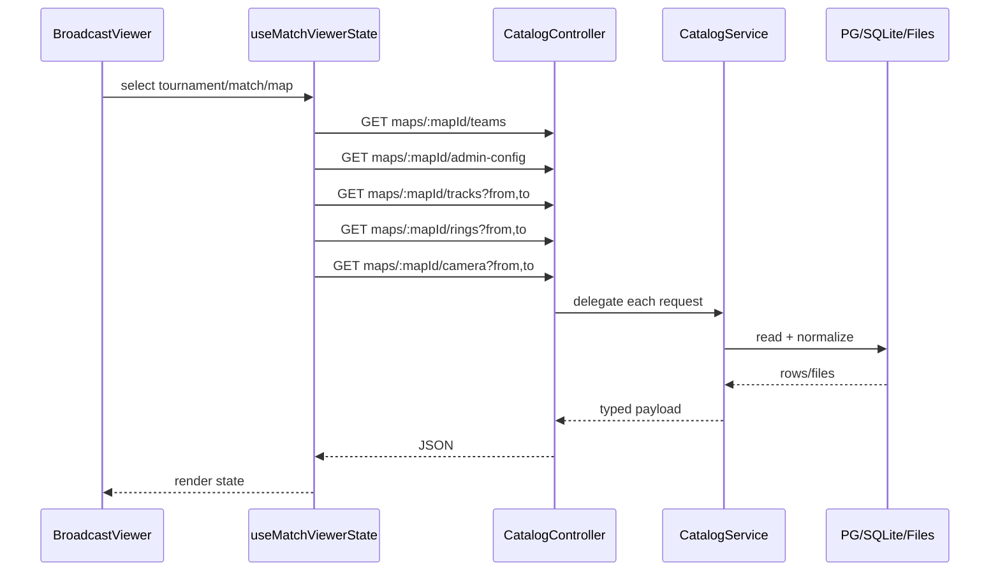

Эта диаграмма детализирует, какие вызовы запускаются после выбора карты. Важный момент: временные окна передаются уже на этапе запросов, уменьшая объем данных для клиента. `CatalogService` инкапсулирует fallback-логику источников, поэтому UI не знает, из какой БД пришел ответ. Это снижает связность и упрощает поддержку. Схема полезна для подпункта «динамическая загрузка и агрегация телеметрии».

Опора на код: `apps/web/lib/useMatchViewerState.ts`, `apps/api/src/modules/catalog/catalog.service.ts`.

### 4.3 Sequence: fallback-загрузка видео

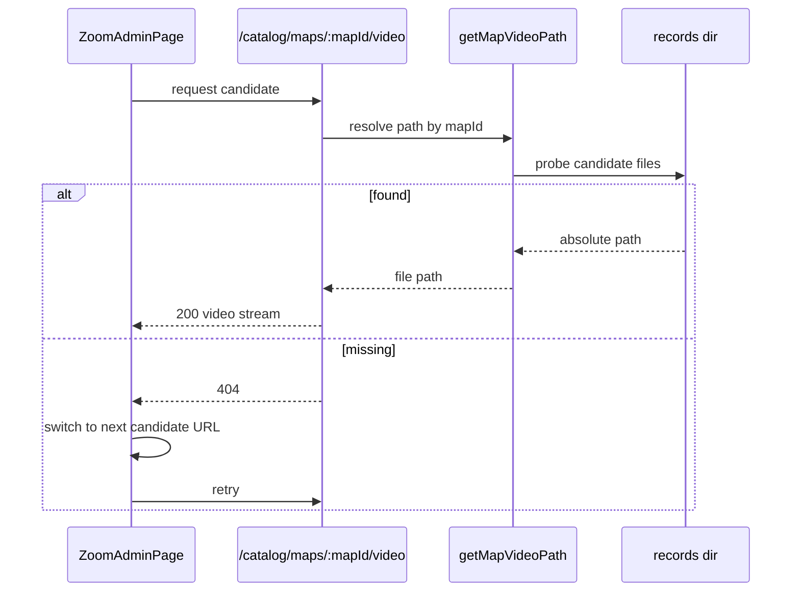

Схема отражает стратегию устойчивой загрузки видео на CAMERA-странице. Сначала используется map-specific endpoint, затем frontend переключается на альтернативные пути, если источник недоступен. На backend путь вычисляется не напрямую из URL, а через набор кандидатов и существование файла. Это заметно уменьшает ручные ошибки в привязке VOD. Для диплома этот кейс хорошо иллюстрирует fault-tolerant UX.

Опора на код: `apps/web/app/admin/zoom/page.tsx`, `apps/api/src/modules/catalog/catalog.service.ts`.

## 5) Алгоритмические схемы

### 5.1 EMA + ring noise tuning

```mermaid
flowchart TD
  start[CameraTrack row] --> ring{Ring changed?}
  ring -- yes --> reset[Reset sx sy sz to raw]
  ring -- no --> noise[Get ring noise slider + limits]
  noise --> k[Compute blend factor k]
  k --> ema[sx+=k*(rawX-sx), sy+=k*(rawY-sy), sz+=k*(rawZ-sz)]
  reset --> out[Derived camera frame]
  ema --> out
```

Блок-схема описывает базовую часть фильтрации камеры в пределах кольца. При смене кольца фильтр переинициализируется, чтобы не переносить ошибку между фазами. Внутри кольца коэффициент `k` зависит от ползунка шума и расширенного диапазона для ранних колец. Это обеспечивает баланс между плавностью и задержкой. Результат — `effective`-координаты камеры, которые используются в рендере и на графиках.

Опора на код: `apps/web/components/map-player.tsx` (`blendFactorFromNoiseSlider`, `deriveCameraFrames`).

### 5.2 Anti-latch (XY и zoom)

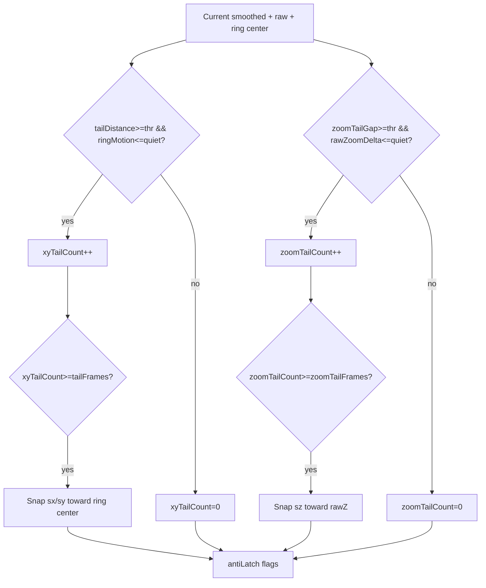

Алгоритм anti-latch борется с «длинным хвостом» фильтра, когда сглаживание отстает от фактической позиции. Для XY анализируется расхождение камеры и центра кольца при низком движении кольца. Для zoom используется аналогичная логика с зазором между сглаженным и raw-масштабом. После накопления кадров хвоста применяется мягкий snap, а не мгновенный jump. Это снижает артефакты и делает траекторию устойчивее.

Опора на код: `apps/web/components/map-player.tsx` (`deriveCameraFrames`).

### 5.3 Pre-jump lock/unlock

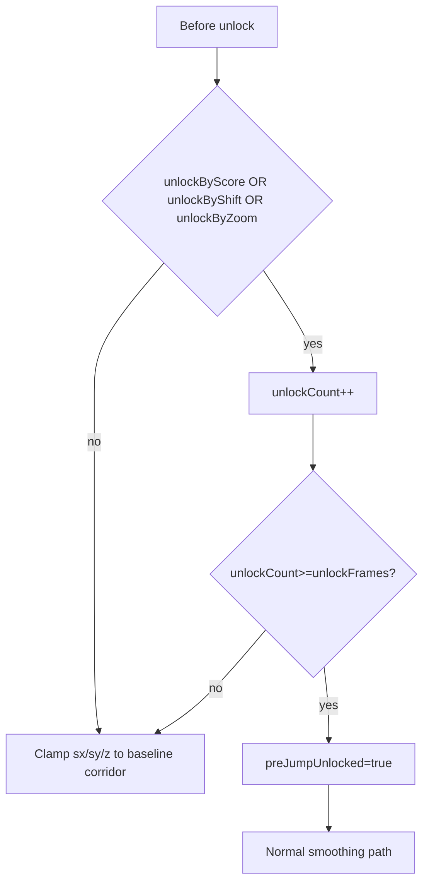

Pre-jump lock вводит жесткий коридор стабильности до подтвержденного реального смещения камеры. Это особенно важно для ранних фаз, где ложные микросдвиги мешают анализу. Unlock срабатывает по совокупности признаков: jumpScore/jumpFlag, достаточный spatial shift или zoom change. Дополнительно применяется требование по количеству последовательных кадров, чтобы убрать одиночные всплески. После unlock камера возвращается к обычной EMA-логике.

Опора на код: `apps/web/components/map-player.tsx` (`deriveCameraFrames`).

### 5.4 Step-shift трансформация треков

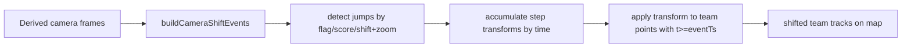

Step-shift нужен, чтобы визуально переносить командные треки после подтвержденных скачков камеры. События прыжков извлекаются из производных camera frames и агрегируются в кумулятивные трансформации. Для каждой точки трека применяется тот суммарный сдвиг/масштаб, который уже накопился к ее timestamp. Это дает ожидаемое поведение «с 8:30 и далее все точки в новых координатах». Схема полезна как ключевая инженерная доработка в дипломе.

Опора на код: `apps/web/components/map-player.tsx` (`buildCameraShiftEvents`, рендер треков).

## 6) UI/UX схемы

### 6.1 Карта экранов и режимов

```mermaid
flowchart TB
  root[/]
  root --> main[Main viewer]
  root --> admin[/admin/index.html]
  root --> camera[/admin/zoom]
  root --> database[/admin/database]
  admin --> hsv[HSV]
  admin --> zones[ZONES]
  admin --> poly[POLYGONS]
  admin --> camtab[CAMERA tab link]
  admin --> dbtab[DATABASE tab link]
```

Диаграмма описывает пользовательскую навигацию по ключевым режимам системы. Основной viewer живет отдельно от legacy admin-страницы, а CAMERA вынесена в отдельный маршрут Next.js. Внутри admin сохранена вкладочная структура для HSV/ZONES/POLYGONS и переходов к CAMERA/DATABASE. Это позволяет совместить старые инструменты и новый synchronized-camera режим. В дипломе можно использовать схему для раздела «Интерфейс оператора».

Опора на код: `apps/web/app/page.tsx`, `apps/web/public/admin/index.html`.

### 6.2 Левое меню (Website menu mapping)

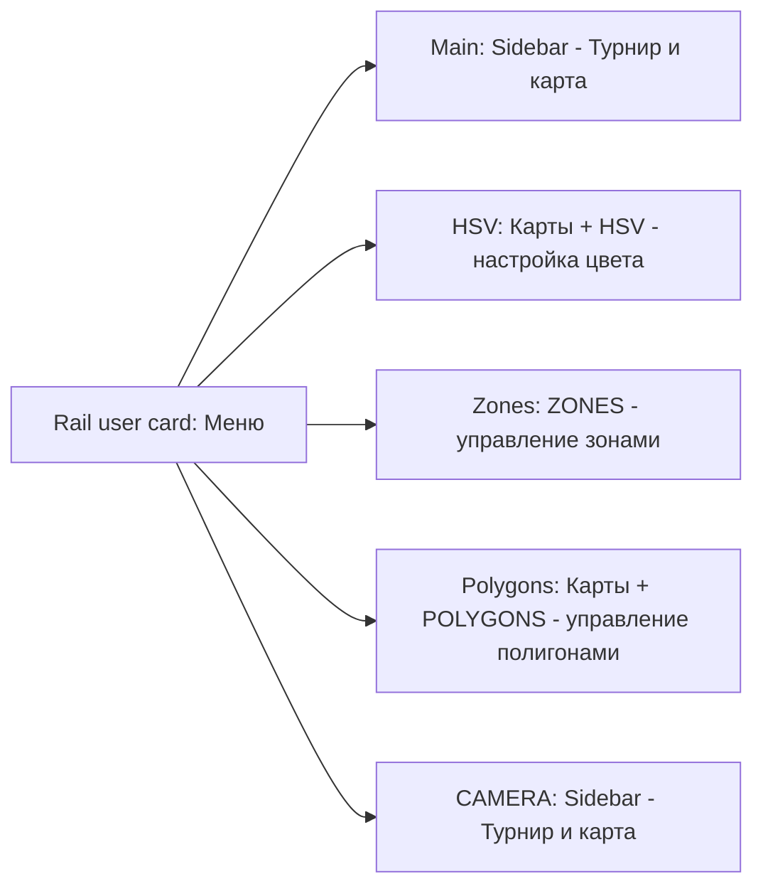

Схема фиксирует итоговую матрицу соответствий «режим -> секции меню», синхронизированную с дизайном Website menu. Это важно для диплома как пример консистентного UX по разным инструментам админки. Главное правило — единая верхняя сущность «Меню» и контекстная вторая секция под задачу страницы. Такой подход уменьшает когнитивную нагрузку при переключении между режимами. В тексте можно подать как «navigation design system».

Опора на код: `apps/web/components/broadcast/BroadcastViewer.tsx`, `apps/web/public/admin/index.html`.

### 6.3 Диаграмма состояний воспроизведения

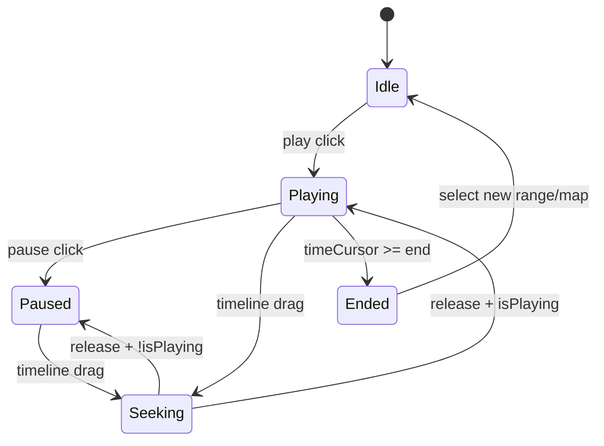

Диаграмма задает формальную модель transport-bar поведения. Она отражает оба источника seek-событий: слайдер и видеоплеер. Переход в `Ended` синхронизирован с конечной границей выбранного диапазона, после чего воспроизведение останавливается. Это позволяет объяснить проверяемость интерфейса через state transitions. Для раздела тестирования эта схема станет основой сценариев.

Опора на код: `apps/web/lib/useMatchViewerState.ts`, `apps/web/components/broadcast/BroadcastViewer.tsx`.

## 7) Деплой и окружение

### 7.1 Локальная разработка

```mermaid
flowchart LR
  dev[Developer machine] --> web[Next.js dev server :8004]
  dev --> api[Nest dev server :4000]
  web --> api
  api --> out[(output/* artifacts)]
  api --> media[(ffmpeg_downloader/records, maps)]
  api --> db1[(postgres local)]
  api --> db2[(sqlite files)]
```

Схема локального стенда показывает минимально достаточное окружение для разработки и демонстрации. Frontend и backend запускаются отдельно, но логически связаны через API URL. Файловые каталоги и SQLite часто используются как быстрый источник в итерациях, даже при наличии PostgreSQL. Это объясняет гибкость запуска на ноутбуке без тяжелого инфраструктурного контура. Схема хорошо подходит в главу «Среда разработки».

Опора на код: `apps/web/lib/api.ts`, `apps/api/src/modules/runtime-paths.ts`.

### 7.2 Production-вариант

```mermaid
flowchart TB
  user[Browser users] --> rp[Reverse proxy]
  rp --> web[Next.js app]
  rp --> api[Nest API]
  api --> pg[(Managed PostgreSQL)]
  api --> fs[(Media + artifact volumes)]
  worker[Ingest/analysis workers] --> fs
  worker --> pg
```

Production-схема отделяет online-контур (web+api) от batch-пайплайна анализа. Reverse proxy выступает точкой маршрутизации и безопасности внешнего доступа. PostgreSQL используется как основной источник, а файловые тома хранят тяжелые медиа и вычисленные артефакты. Воркер-процессы обновляют данные асинхронно и не блокируют пользовательские запросы. Это типовая архитектура для сервисов с video analytics.

Опора на код: `apps/api/src/modules/postgres.ts`, `apps/api/src/modules/catalog/catalog.service.ts`.

### 7.3 Внешние интеграции (Figma MCP)

```mermaid
flowchart LR
  ui[Local app pages] --> capture[Manual "Copy to Figma"]
  capture --> figma[Figma file/pages]
  mcp[Figma MCP tools] <--> figma
  operator[Designer/Engineer] --> mcp
```

Диаграмма показывает, что интеграция с Figma в проекте гибридная: ручной capture и MCP-инструменты. Такой подход позволяет быстро переносить экраны и одновременно работать с дизайн-системой внутри Figma. В дипломе это можно оформить как «внешний контур визуальной валидации UI». Интеграция не влияет на runtime ядро продукта, но ускоряет UX-итерации. Отдельное выделение полезно для раздела о практической применимости.

Опора на код: `apps/web/app/admin/page.tsx`, практический workflow через Figma MCP.

## 8) Тестирование и валидация

### 8.1 Тестовый контур

```mermaid
flowchart TB
  req[Change request] --> apiTests[API functional checks]
  req --> uiChecks[Manual UI regression checks]
  req --> algoChecks[Camera sanity checks]
  apiTests --> verdict[Acceptance verdict]
  uiChecks --> verdict
  algoChecks --> verdict
```

Схема фиксирует три независимых ветки проверки после изменений: API, UI и алгоритмы. Это важно, потому что система объединяет backend-контракты и визуальную математику камеры. Даже при корректном JSON-ответе могут оставаться визуальные артефакты на карте, поэтому нужен алгоритмический sanity-check. Финальный verdict принимается только после объединения результатов веток. Такой процесс хорошо соответствует инженерной части диплома.

Опора на код: `apps/web/components/map-player.tsx`, `apps/api/src/modules/catalog/catalog.controller.ts`.

### 8.2 Метрики качества камеры

```mermaid
flowchart LR
  input[CameraTrack + rendered map] --> m1[Stability jitter]
  input --> m2[False unlock count]
  input --> m3[Anti-latch trigger stats]
  input --> m4[Visual coherence map-video-charts]
  m1 --> score[Quality score/report]
  m2 --> score
  m3 --> score
  m4 --> score
```

Диаграмма представляет каркас метрик, который можно использовать как количественное приложение к диплому. Блок `jitter` оценивает плавность траектории, `false unlock` — надежность pre-jump lock, а anti-latch статистика — устойчивость к ложным хвостам. Отдельно проверяется визуальная согласованность между картой, видео и графиками. Совокупный score подходит для сравнения пресетов и версий алгоритма. Это связывает теорию алгоритмов и практическое качество интерфейса.

Опора на код: `apps/web/components/map-player.tsx`, `apps/web/components/broadcast/CameraTimelineCharts.tsx`.

---

## Единый словарь обозначений (для всех диаграмм)

- `mapId` — ключ агрегата «конкретная карта матча».
- `timeCursor` — единый курсор времени UI.
- `rawX/rawY/rawZ` — исходные координаты/масштаб камеры из данных.
- `sx/sy/sz` — сглаженные (effective) координаты/масштаб.
- `anti-latch` — коррекция длинного хвоста фильтра.
- `pre-jump lock` — ограничение дрейфа до подтвержденного скачка.
- `step-shift` — кумулятивная трансформация треков после jump-событий.
