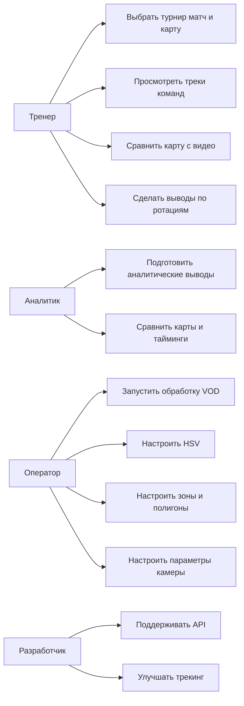

# Глава 1. Разработка требований

## 1.1 Выявление требований

Разработка требований является первым этапом создания программного продукта. На этом этапе нужно понять, какую проблему решает система, кто будет ей пользоваться и какие функции должны быть реализованы в первую очередь. Для проекта Apex Stats Parser требования определялись исходя из практической задачи тренера киберспортивной команды по Apex Legends.

Основная проблема состоит в том, что анализ матчей в Apex Legends занимает много времени. В одном матче может участвовать до 20 команд. Если тренер вручную отслеживает перемещение одной команды по записи трансляции примерно 3 минуты, то первичный просмотр всех команд занимает около 60 минут. При разборе серии из нескольких карт это превращается в несколько часов однотипной ручной работы. Поэтому было решено разработать систему, которая автоматически строит треки команд по записям трансляций и отображает их на интерактивной карте.

При выявлении требований использовались несколько методов.

Первый метод — коммуникация с заинтересованными лицами. В качестве конечного пользователя рассматривается тренер или аналитик киберспортивной команды. Для него важны не сами технические данные, а возможность быстро увидеть ротации команд, сравнить поведение соперников и найти ошибки позиционирования. Также заинтересованным лицом является условный владелец бизнеса или киберспортивная организация, которой может быть полезен такой продукт. Для организации важны скорость анализа, повторное использование данных и возможность в будущем расширить систему до heat-map, страницы команд и live-анализа.

Второй метод — анализ нормативных документов. Так как проект является программным продуктом, для оформления требований можно ориентироваться на стандарты ЕСПД и стандарты по созданию автоматизированных систем. Например, ГОСТ 19.201-78 описывает требования к содержанию и оформлению технического задания, а ГОСТ 34.601-90 описывает стадии создания автоматизированных систем [48], [49]. Также при проектировании нужно учитывать вопросы защиты данных. В проекте в основном используются публичные записи трансляций, но результаты анализа, маршруты команд, heat-map и выводы тренера могут иметь коммерческую ценность. Поэтому в дальнейшем для production-версии потребуется ограничение доступа к API и административным функциям.

Третий метод — анализ аналогов. В качестве аналогов рассматривались не только прямые продукты для Apex Legends, но и в целом инструменты спортивной и киберспортивной аналитики: системы просмотра матчей, тепловые карты, трекеры перемещений, статистические dashboards. Анализ аналогов показал, что удобный аналитический инструмент должен не просто хранить данные, а предоставлять визуальное представление: карту, таймлайн, фильтры, выбор матча и возможность быстро перейти к нужному моменту. Официальные материалы Apex Legends и ALGS использовались для понимания предметной области и турнирного контекста [28], [29].

Четвертый метод — наблюдение за конечным пользователем. В данном случае рассматривался рабочий процесс тренера: он открывает запись матча, смотрит положение команд, вручную запоминает или фиксирует ротации, затем повторяет это для других команд. Такой процесс плохо масштабируется, потому что тренер тратит время не на выводы, а на механическое отслеживание. Из этого наблюдения появилось ключевое требование: система должна показывать все команды на карте одновременно и синхронизировать отображение с таймлайном и видео.

~~На основе выявления требований были определены основные группы пользователей:

- тренер команды — анализирует ротации, ошибки позиционирования и поведение соперников;
- аналитик — готовит материалы по матчам, сравнивает карты и команды;
- оператор системы — запускает обработку записей, проверяет результат, настраивает HSV, зоны и параметры камеры;
- разработчик — поддерживает pipeline обработки видео, backend API и web-интерфейс;
- киберспортивная организация — рассматривает систему как продукт для ускорения аналитики.~~

*На основе выявления требований были определены основные пользователи системы. Главным пользователем является тренер команды, которому нужно быстро анализировать ротации, ошибки позиционирования и поведение соперников. Также системой может пользоваться аналитик, который готовит материалы по матчам и сравнивает карты между собой. Отдельную роль занимает оператор системы: он запускает обработку записей, проверяет результат и настраивает параметры распознавания, например HSV, зоны и камеру. Разработчик отвечает за поддержку pipeline, API и web-интерфейса. Для киберспортивной организации система рассматривается как инструмент, который может сократить время анализа и в дальнейшем стать коммерческим продуктом.*

~~Для проекта были сформулированы следующие функциональные требования:

- система должна принимать или использовать записи трансляций Apex Legends;
- система должна хранить сведения о турнирах, матчах и картах;
- система должна определять рабочий фрагмент карты;
- система должна строить треки команд по времени;
- система должна получать данные о кольцах;
- система должна получать и сглаживать параметры камеры;
- система должна предоставлять API для web-интерфейса;
- система должна отображать карту, команды, треки и таймлайн;
- система должна синхронизировать карту, видео и графики;
- система должна иметь административные инструменты для настройки HSV, зон, полигонов и параметров камеры;
- система должна сохранять результаты анализа для повторного использования.~~

*В результате выявления требований было определено, что система должна принимать записи трансляций Apex Legends, хранить сведения о турнирах, матчах и картах, определять рабочий фрагмент карты и строить треки команд по времени. Кроме этого, система должна получать данные о кольцах и камере, предоставлять API для web-интерфейса и отображать результаты на интерактивной карте. Важной частью является синхронизация карты, видео и графиков, так как тренеру нужно не только увидеть трек, но и проверить его по записи матча. Для подготовки данных также нужны административные инструменты, позволяющие настраивать HSV, зоны, полигоны и параметры камеры.*

~~Также были определены нефункциональные требования:

- интерфейс должен быть понятным для тренера и не требовать работы напрямую с файлами;
- система должна быть воспроизводимой: одинаковые входные данные и настройки должны давать одинаковый результат;
- система должна поддерживать расширение под новые турниры, карты и записи;
- система должна быть устойчивой к неполным данным, так как часть информации может храниться в SQLite, JSON или PostgreSQL;
- система должна позволять отлаживать качество трекинга через графики камеры и визуальную проверку;
- архитектура должна позволять дальнейшее развитие продукта.~~

*К нефункциональным требованиям относятся удобство интерфейса, воспроизводимость результата, расширяемость и устойчивость к неполным данным. Интерфейс должен быть понятным для тренера и не должен требовать ручной работы с JSON или SQLite-файлами. Один и тот же VOD при одинаковых настройках должен давать одинаковый результат, чтобы анализ можно было проверить повторно. Также система должна поддерживать новые карты и турниры, а при отсутствии части данных не должна полностью прекращать работу. Это важно, потому что на этапе разработки часть информации хранится в PostgreSQL, часть — в SQLite, а часть — в JSON-артефактах.*

## 1.2 Анализ требований

После выявления требований они были разделены на несколько уровней: бизнес-требования, пользовательские требования и требования реализации. Такое разделение помогает понять, какие требования связаны с целью продукта, какие — с работой пользователя, а какие — с технической реализацией.

Бизнес-требования описывают, зачем создается система. Главная бизнес-цель проекта — сократить время ручного анализа матчей Apex Legends и сделать процесс подготовки аналитики более удобным. Если тренер тратит около часа на первичную ручную разметку одного матча, то автоматическое построение треков может заметно уменьшить рутинную часть работы. Для киберспортивной организации это может быть полезно, потому что тренер быстрее получает материал для разбора и может больше времени уделять тактическим выводам.

~~К бизнес-требованиям относятся:

- сокращение времени ручного отслеживания команд;
- повышение повторяемости анализа;
- накопление базы матчей и карт;
- возможность дальнейшей коммерциализации продукта;
- подготовка основы для heat-map, страницы команд и live-анализа.~~

*Бизнес-требования отражают основную цель проекта: сократить время ручного анализа матчей Apex Legends и сделать подготовку аналитики более удобной. Для тренера ценность системы заключается в том, что она берет на себя рутинное отслеживание команд и позволяет быстрее перейти к тактическим выводам. Для киберспортивной организации это дает возможность накапливать базу матчей, сравнивать карты и в будущем развивать продукт в сторону heat-map, страницы команд и live-анализа.*

Пользовательские требования описывают, что должен уметь делать пользователь в системе. Тренеру не нужно видеть внутреннюю структуру pipeline или баз данных. Ему нужно выбрать турнир, матч и карту, увидеть перемещения команд, перейти к нужному моменту времени и сравнить карту с видео. Оператору системы, наоборот, нужны инструменты настройки: HSV, зоны, полигоны, графики камеры и параметры сглаживания.

~~К пользовательским требованиям относятся:

- выбор турнира, матча и карты;
- просмотр интерактивной карты с командами;
- перемещение по таймлайну;
- отображение кольца и текущей игровой фазы;
- синхронизация карты и видео;
- просмотр графиков камеры;
- изменение параметров сглаживания камеры;
- настройка HSV и зон через административный интерфейс.~~

*Пользовательские требования связаны с тем, как тренер или оператор будет работать с системой. Тренер должен иметь возможность выбрать турнир, матч и карту, увидеть интерактивную карту с командами, перемещаться по таймлайну и сравнивать происходящее с видео. Оператору нужны дополнительные инструменты настройки: просмотр графиков камеры, изменение параметров сглаживания, настройка HSV и зон через административный интерфейс. Таким образом, одна часть интерфейса рассчитана на анализ, а другая — на подготовку и проверку данных.*

Требования реализации описывают, как система должна быть устроена технически. Проект состоит из нескольких частей: pipeline обработки видео, backend API, хранилища данных и frontend. Для обработки видео используются Python-инструменты и OpenCV. Для backend API используется NestJS, для web-интерфейса — Next.js и React. Эти технологии выбраны потому, что они подходят для задач проекта: Python удобен для компьютерного зрения, а React/Next.js — для интерактивного интерфейса [1], [2], [5], [8], [46], [47].

~~К требованиям реализации относятся:

- хранение данных о турнирах, матчах, картах и треках;
- чтение данных из PostgreSQL, SQLite и JSON-артефактов;
- REST API для связи frontend и backend;
- Canvas-отрисовка карты и треков;
- синхронизация состояния через общий временной курсор;
- отдельный режим CAMERA для проверки карты, видео и графиков;
- возможность дальнейшего разделения backend на более мелкие сервисы.~~

*Требования реализации описывают техническую сторону проекта. Система должна хранить данные о турнирах, матчах, картах, треках и камере, читать их из PostgreSQL, SQLite и JSON-артефактов, а затем отдавать во frontend через REST API. Для отображения карты требуется Canvas-отрисовка, а для синхронизации карты, видео и графиков используется общий временной курсор. Отдельный режим CAMERA нужен для проверки качества трекинга и настройки параметров камеры. В дальнейшем backend можно разделить на более мелкие сервисы, чтобы упростить поддержку проекта.*

Дополнительно требования были разделены по приоритетам.

~~К MVP относятся:

- обработка VOD;
- получение карты, колец, камеры и треков команд;
- сохранение результатов анализа;
- API для чтения данных;
- основная web-визуализация;
- страница CAMERA;
- базовые admin-инструменты HSV, ZONES и POLYGONS.~~

*На этапе MVP в систему включаются только функции, необходимые для демонстрации основной ценности продукта. К ним относятся обработка VOD, получение карты, колец, камеры и треков команд, сохранение результатов анализа, API для чтения данных, основная web-визуализация, CAMERA-страница и базовые admin-инструменты HSV, ZONES и POLYGONS. Этого достаточно, чтобы тренер мог выбрать матч, увидеть перемещения команд и проверить качество результата по видео.*

~~К перспективным требованиям относятся:

- страница команды с историей матчей;
- heat-map по каждой команде и карте;
- быстрый анализ в live-режиме;
- более точный camera tracking;
- автоматическая оценка качества трекинга;
- переход к более строгой архитектуре с едиными API-контрактами.~~

*Перспективные требования связаны с дальнейшим развитием продукта. После реализации базового варианта можно добавить страницу команды с историей матчей, heat-map по каждой команде и карте, быстрый live-анализ, автоматическую оценку качества трекинга и более точный camera tracking. Эти функции не являются обязательными для защиты MVP, но важны для коммерческого развития системы.*

Live-анализ не был включен в основной объем MVP, потому что он сложнее batch-обработки. Для live-режима нужно обрабатывать видеопоток почти в реальном времени, учитывать задержки, очереди кадров и быстро обновлять интерфейс. Для ВКР более реалистичным вариантом является анализ записей трансляций, так как его проще проверить и воспроизвести.

В результате анализа требований было принято решение строить систему вокруг карты матча. Карта является основным объектом, к которому привязаны команды, треки, кольца, камера, видео и настройки. Такой подход упрощает работу frontend и API: пользователь выбирает карту, а система загружает все связанные данные.

## 1.3 Спецификация требований

Спецификация требований представляет собой более точное описание того, что должна делать система. Для функциональных требований удобно использовать диаграмму вариантов использования, потому что она показывает, какие пользователи взаимодействуют с системой и какие действия они выполняют.

### Диаграмма вариантов использования

Основной вариант использования — анализ матча тренером. Пользователь открывает web-интерфейс, выбирает турнир, матч и карту. После выбора система загружает команды, треки, кольца и данные камеры. Пользователь видит карту, перемещает временной курсор и смотрит, как менялись позиции команд. Если нужно проверить качество трекинга, он открывает CAMERA-режим и сравнивает карту с видео.

Второй важный вариант использования — настройка данных оператором. Оператор запускает обработку VOD и проверяет, корректно ли определены карта, кольца и треки. Если качество недостаточное, он может настроить HSV-диапазоны, зоны, полигоны и параметры камеры. Это нужно, потому что записи трансляций могут отличаться по качеству, оверлеям и масштабу.

Третий вариант использования — сопровождение системы разработчиком. Разработчик поддерживает API, улучшает алгоритмы трекинга и добавляет новые функции. Например, в дальнейшем можно добавить страницу команд, heat-map и live-анализ.

### Функциональные требования

Функциональные требования можно описать следующим образом.

Система должна предоставлять каталог турниров, матчей и карт. Пользователь должен иметь возможность выбрать нужный турнир, затем матч и карту. После выбора карты система должна загрузить все связанные данные.

Система должна строить и отображать треки команд. Треки должны отображаться на карте и изменяться при перемещении по таймлайну. Пользователь должен видеть положение команд относительно зоны и текущего времени.

Система должна отображать данные колец. Это важно, потому что в Apex Legends решения команд сильно зависят от положения безопасной зоны. В интерфейсе должен отображаться текущий раунд или фаза кольца.

Система должна поддерживать данные камеры. Камера трансляции может сдвигаться и масштабироваться, поэтому система должна позволять анализировать `cameraX`, `cameraY`, `zoomRatio` и jump-события. Для этого нужна CAMERA-страница с графиками и видеоплеером.

Система должна синхронизировать карту, видео и графики. Для этого используется единый временной курсор. При изменении времени должны обновляться карта, графики и видео.

Система должна предоставлять административные инструменты. В текущей версии это HSV, ZONES, POLYGONS и настройки камеры. Эти инструменты нужны для подготовки данных и улучшения качества анализа.

### Нефункциональные характеристики качества

К нефункциональным требованиям относятся характеристики качества, которые не описывают отдельную функцию, но влияют на пригодность системы.

Удобство использования. Интерфейс должен быть понятным для тренера. Пользователь не должен вручную открывать JSON или SQLite-файлы. Основные действия должны выполняться через web-интерфейс.

Производительность. Система должна позволять обрабатывать записи матчей за приемлемое время. Так как анализ VOD может быть тяжелым, обработка может выполняться пакетно, а не в реальном времени.

Надежность. Если часть данных отсутствует, система не должна полностью ломаться. Например, backend может использовать fallback-источники данных в SQLite или JSON.

Расширяемость. В дальнейшем должна быть возможность добавить новые страницы, например страницу команды и heat-map. Также должна быть возможность подключать новые карты и турниры.

Сопровождаемость. Код должен быть разделен на понятные части: frontend, backend, обработка видео, хранение данных. В будущем `CatalogService` можно разделить на более узкие сервисы.

Безопасность. В MVP система может использоваться локально, но в production-версии нужно ограничить доступ к API и административным функциям. Особенно это важно для результатов анализа, потому что heat-map и маршруты команд могут иметь стратегическую ценность.

Воспроизводимость. Один и тот же VOD при одинаковых настройках должен давать одинаковый результат. Это важно для проверки и сравнения матчей.

### Критерии приемки

~~Для проверки выполнения требований можно использовать следующие критерии:

- пользователь может открыть web-приложение;
- пользователь может выбрать турнир, матч и карту;
- система загружает команды, треки и кольца;
- карта отображает треки команд;
- таймлайн изменяет положение команд на карте;
- CAMERA-страница показывает карту, видео и графики;
- настройки камеры влияют на отображение треков;
- API возвращает данные без ручного доступа к файлам;
- admin-инструменты позволяют настроить HSV, зоны и полигоны;
- система показывает сокращение ручной работы по сравнению с полностью ручным анализом.~~

*Критерии приемки можно сформулировать через основной пользовательский сценарий. Система считается работоспособной, если пользователь может открыть web-приложение, выбрать турнир, матч и карту, после чего на экране отображаются команды, треки и данные кольца. При изменении таймлайна положение команд на карте должно обновляться. CAMERA-страница должна показывать карту, видео и графики, а настройки камеры должны влиять на отображение треков. Также API должен возвращать данные без необходимости вручную открывать файлы, а admin-инструменты должны позволять настраивать HSV, зоны и полигоны. В итоге система должна показывать, что часть ручной работы тренера действительно переносится в автоматизированный процесс.*

Таким образом, в первой главе были определены основные пользователи системы, методы выявления требований, уровни требований и спецификация функций. Полученные требования используются дальше при проектировании архитектуры, выборе технологий и реализации программного продукта.

