# Глава 2. Проектирование

## 2.1 Эскизное проектирование

На этапе эскизного проектирования была определена общая структура системы Apex Stats Parser. Главная задача проекта состоит в том, чтобы по записи трансляции Apex Legends получить данные о перемещении команд и показать их тренеру в удобном виде. Поэтому система проектировалась не как обычный сайт, а как набор связанных частей: обработка видео, хранение данных, backend API и web-интерфейс.

В проекте можно выделить четыре основные части:

1. Pipeline обработки видео.
2. Слой хранения данных.
3. Backend API.
4. Frontend и административный интерфейс.

Pipeline обработки видео отвечает за получение записи, подготовку клипов, определение начала карты, распознавание колец, камеры и командных точек. Для этой части используются Python, OpenCV, FFmpeg и вспомогательные библиотеки, так как они хорошо подходят для обработки кадров и видео [8], [13], [14], [46], [47].

Слой хранения данных нужен для сохранения результатов обработки. В проекте используются PostgreSQL, SQLite и JSON-артефакты. PostgreSQL подходит для основных структурированных данных, например турниров, матчей и карт [6], [45]. SQLite удобен для локальных промежуточных результатов, потому что такие файлы просто создавать и проверять во время разработки [7].

Backend API реализован на NestJS. Он скрывает от frontend физическое расположение данных и возвращает их в едином формате. Это важно, потому что часть данных может находиться в PostgreSQL, часть — в SQLite, а часть — в JSON-файлах. Frontend при этом не должен знать, откуда именно пришли данные [5], [25].

Frontend реализован на Next.js и React. Он нужен для выбора турнира, матча и карты, отображения командных треков, карты, видео, таймлайна и настроек камеры. React удобен для такого интерфейса, потому что на странице много связанных элементов, которые должны обновляться вместе [1], [2], [42], [43].

Общая эскизная схема системы представлена ниже.

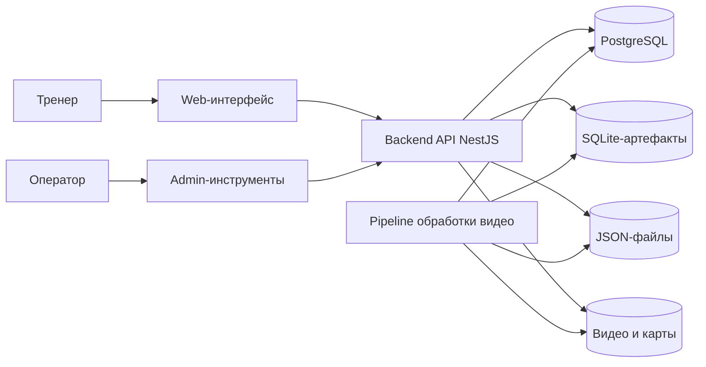

Эту схему следует приложить к главе как рисунок «Общая архитектура системы». Она показывает, что пользователь работает через web-интерфейс, а все данные проходят через backend API. Прямой доступ к файлам и базе данных пользователю не нужен.

Для проекта был выбран подход, при котором основным объектом является карта матча. Это удобно, потому что почти все данные привязаны именно к карте: команды, треки, кольца, камера, видео, настройки HSV, зоны и полигоны. Пользователь сначала выбирает турнир, затем матч, затем карту, и после этого система загружает связанные данные.

Схема связи основных сущностей показана ниже.

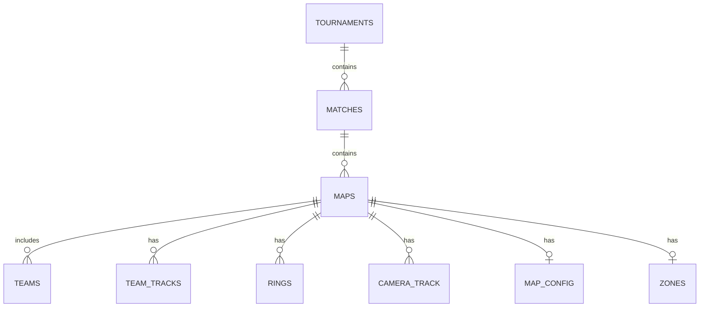

Эту ER-диаграмму следует приложить к разделу проектирования данных. Она показывает, что карта является центральной сущностью, к которой привязаны основные результаты обработки.

Также на этапе эскизного проектирования была определена логика движения данных. Сначала система получает запись трансляции, затем выполняет обработку, сохраняет результаты и отображает их в интерфейсе.

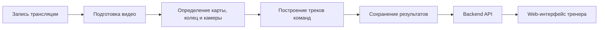

Эту схему можно использовать как рисунок «Поток данных в системе». Она помогает объяснить, что сайт не создает данные сам, а получает уже подготовленные результаты обработки видео.

## 2.2 Детальное проектирование

На этапе детального проектирования каждая часть системы была рассмотрена отдельно. Это нужно для того, чтобы понять, какие модули входят в проект, какие данные они принимают и какой результат должны вернуть.

### 2.2.1 Проектирование pipeline обработки видео

Pipeline обработки видео является одной из самых важных частей проекта. Он отвечает за получение исходного видео и подготовку данных, которые потом используются на сайте. Так как игра не предоставляет готовые координаты команд из трансляции, данные приходится извлекать из изображения.

Обработка начинается с получения или синхронизации VOD. Для этого используются инструменты загрузки и работы с видео. `yt-dlp` помогает получать видеоматериалы, а FFmpeg используется для нарезки, конвертации и подготовки фрагментов [13], [14]. После этого Python-скрипты обрабатывают кадры и сохраняют результаты.

В pipeline можно выделить несколько шагов:

1. Получение записи трансляции.
2. Подготовка видеофрагмента нужной карты.
3. Определение начала карты.
4. Распознавание колец и параметров камеры.
5. Настройка зон и HSV.
6. Построение треков команд.
7. Сохранение результата в SQLite, JSON и PostgreSQL.

Схема pipeline представлена ниже.

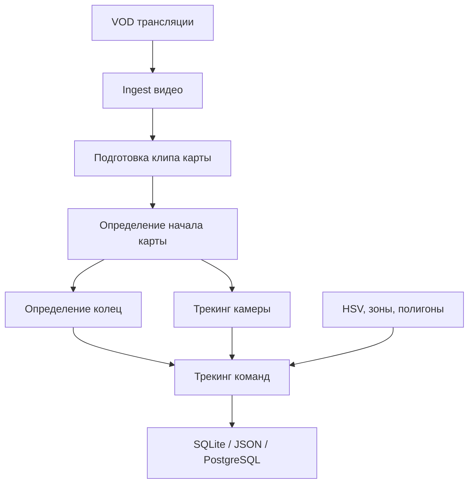

Эту схему нужно приложить к разделу как «Pipeline обработки VOD». Также рядом логично добавить скриншот структуры папки `output`, пример JSON-файла с треками и пример результата в `camera.sqlite`.

Для обработки кадров используется OpenCV. Он позволяет работать с изображением, цветами, областями кадра и координатами [8], [47]. Для численных операций применяется NumPy [9]. Такой набор подходит для проекта, потому что большая часть данных получается не из готового игрового API, а из изображения трансляции.

### 2.2.2 Проектирование backend и API

Backend API является промежуточным слоем между интерфейсом и данными. Он нужен для того, чтобы frontend не работал напрямую с файлами и базой данных. Пользователь открывает сайт, выбирает турнир, матч и карту, а frontend делает запросы к API.

Основным модулем backend является модуль каталога. Он отвечает за получение турниров, матчей, карт, команд, треков, колец, камеры, видео и административных настроек. Такой подход удобен, потому что большая часть данных используется вокруг одной выбранной карты.

Основные API-запросы можно представить так:

| Endpoint | Назначение |
|---|---|
| `/catalog/tournaments` | Получение списка турниров |
| `/catalog/tournaments/:tournamentId/matches` | Получение матчей турнира |
| `/catalog/matches/:matchId/maps` | Получение карт матча |
| `/catalog/maps/:mapId/teams` | Получение команд на карте |
| `/catalog/maps/:mapId/tracks` | Получение треков команд |
| `/catalog/maps/:mapId/rings` | Получение данных колец |
| `/catalog/maps/:mapId/camera` | Получение данных камеры |
| `/catalog/maps/:mapId/video` | Получение видео для карты |
| `/catalog/maps/:mapId/admin-config` | Получение административных настроек |
| `/catalog/maps/:mapId/zones` | Получение зон карты |
| `/catalog/maps/:mapId/text-zones` | Получение текстовых зон |

Карту endpoint-ов следует приложить к главе как таблицу или отдельную схему. Также можно добавить скриншоты JSON-ответов для `/catalog/maps/:mapId/tracks` и `/catalog/maps/:mapId/camera`.

Схема backend-компонентов:

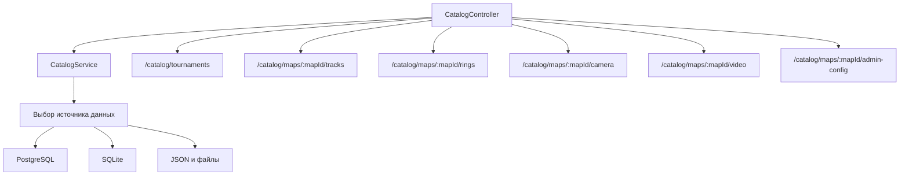

Backend спроектирован так, чтобы при необходимости читать данные из разных источников. Это удобно на этапе разработки, потому что часть результатов появляется сначала как локальные файлы. Но для дальнейшего развития лучше постепенно переносить основные данные в PostgreSQL и делать его главным источником.

### 2.2.3 Проектирование модели данных

Модель данных строится вокруг карты. Такой вариант выбран потому, что пользователь в интерфейсе фактически работает с конкретной картой конкретного матча. Все важные данные также относятся к карте.

Карта связана с командами, треками, кольцами, камерой, видео и настройками. Благодаря этому frontend может загрузить все нужные данные по одному `mapId`. Это упрощает код интерфейса и делает работу страницы более понятной.

Логика map-centric запросов показана ниже.

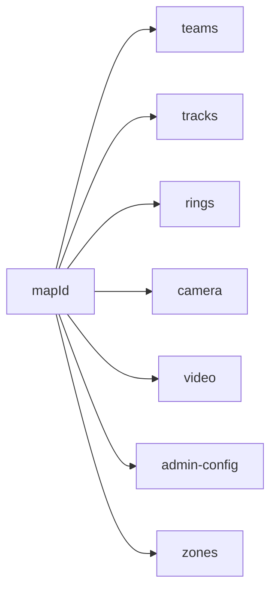

Эту схему следует приложить как «Связь данных вокруг карты». Она показывает, почему в API большинство запросов начинается с `/catalog/maps/:mapId`.

### 2.2.4 Проектирование frontend

Frontend проектировался как рабочий инструмент тренера и оператора. Тренеру нужно быстро выбрать матч и посмотреть перемещение команд. Оператору нужно проверить качество распознавания и при необходимости настроить HSV, зоны, полигоны и камеру.

Главная страница показывает карту, список команд, таймлайн, кольца и треки. Пользователь выбирает турнир, матч и карту, после чего система загружает связанные данные. При изменении времени на таймлайне карта обновляет положение команд.

Для управления состоянием используется общий state. В нем хранятся выбранный турнир, матч, карта, команды, треки, кольца, камера, `timeCursor`, состояние воспроизведения и настройки отображения. Такой подход удобен, потому что несколько частей интерфейса должны реагировать на одно и то же время.

Схема frontend-компонентов:

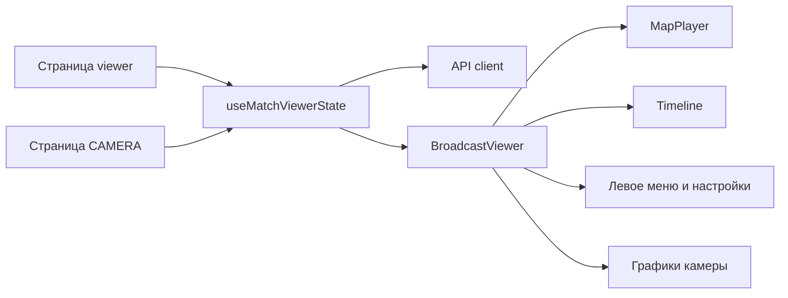

Эту схему нужно приложить к разделу проектирования frontend. Также следует добавить скриншот главной страницы с картой, списком команд и таймлайном.

Важной частью frontend является единый временной курсор `timeCursor`. Он синхронизирует карту, таймлайн, видео и графики. Если пользователь перемещает видео или таймлайн, все остальные элементы должны показать тот же момент матча.

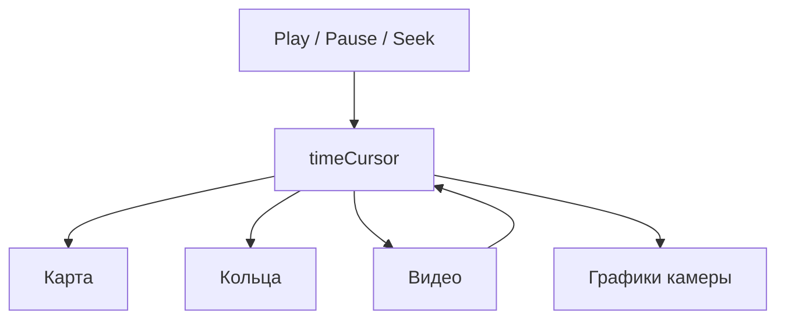

Эту схему следует приложить рядом со скриншотом CAMERA-страницы, потому что на этой странице синхронизация времени заметна лучше всего.

### 2.2.5 Проектирование алгоритмов камеры и треков

Отдельное внимание в проекте уделяется камере. В трансляции камера может смещаться и изменять масштаб. Если это не учитывать, точки команд на карте будут отображаться неправильно. Поэтому в проекте предусмотрены механизмы сглаживания и корректировки.

EMA-сглаживание используется для уменьшения шума в координатах камеры. Для разных колец можно применять разные параметры, потому что в начале матча шум может быть сильнее. Anti-latch нужен для борьбы с длинными ложными смещениями. Pre-jump lock удерживает камеру до подтвержденного скачка. Step-shift применяет накопленное смещение к трекам команд после события изменения камеры.

Схема обработки камеры:

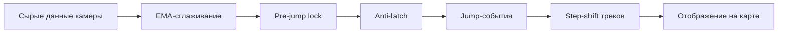

Эту схему следует приложить к разделу проектирования алгоритмов. Также нужны скриншоты графиков камеры до и после сглаживания, скриншот маркеров jump-событий и два скриншота карты: с выключенным и включенным camera-shift.

## 2.3 Интерфейсное проектирование

Интерфейс проектировался так, чтобы тренер мог быстро перейти от выбора матча к просмотру карты. Поэтому основная логика интерфейса строится вокруг левого меню и рабочей области. В левом меню находятся выбор турнира, матча и карты, а в рабочей области отображается карта, команды, таймлайн, видео или настройки.

В проекте предусмотрены несколько основных экранов:

1. Main viewer.
2. HSV.
3. ZONES.
4. POLYGONS.
5. CAMERA.
6. DATABASE/Workspace при необходимости.

Карту экранов следует приложить к главе как отдельную схему.

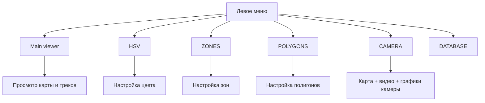

На главной странице пользователь видит карту, команды и таймлайн. Этот экран нужен для обычного просмотра результата. В ВКР следует приложить скриншот главной страницы после выбора турнира, матча и карты.

Страница HSV нужна для настройки цветовых параметров. Она помогает подготовить данные для распознавания. В ВКР следует приложить скриншот HSV-страницы и кратко пояснить, что она используется оператором для настройки распознавания по цвету.

Страница ZONES нужна для настройки зон карты. Зоны помогают ограничить область поиска и сделать обработку более точной. В ВКР следует приложить скриншот страницы ZONES с выбранной картой.

Страница POLYGONS используется для настройки полигонов. Они нужны для более точного описания областей на карте. В ВКР следует приложить скриншот страницы POLYGONS и схему того, как полигоны связаны с картой.

Страница CAMERA является отдельным экраном для проверки камеры. На ней карта и видео расположены рядом, а ниже находятся графики камеры. Настройки вынесены в левую часть, чтобы оператор мог менять параметры и сразу видеть результат. В ВКР следует приложить скриншот CAMERA-страницы, скриншот графиков и скриншот настроек сглаживания.

Упрощенная схема CAMERA-экрана:

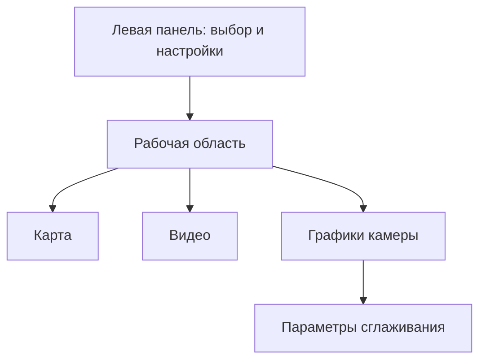

В интерфейсном проектировании также важно показать единый стиль меню. Для всех основных страниц используется одинаковая левая панель. Это делает систему понятнее: пользователь не должен заново разбираться с расположением элементов на каждой странице.

Схема левого меню:

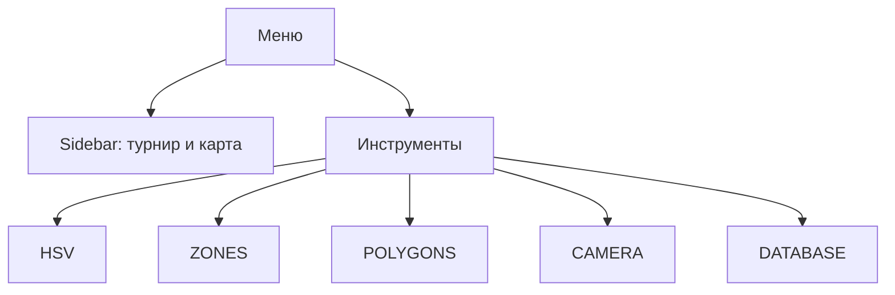

Для интерфейсного проектирования можно приложить следующие материалы:

1. Скриншот главной страницы.
2. Скриншот CAMERA-страницы с картой и видео.
3. Скриншот графиков камеры.
4. Скриншот HSV.
5. Скриншот ZONES.
6. Скриншот POLYGONS.
7. Схему экранов.
8. Схему левого меню.
9. Схему синхронизации `timeCursor`.

В результате проектирования была получена структура системы, где каждая часть отвечает за свою задачу. Pipeline извлекает данные из видео, хранилище сохраняет результаты, backend API отдает данные в едином формате, а frontend показывает их тренеру и оператору. Такой подход подходит для дипломного проекта, потому что он разделяет сложную задачу на понятные модули и позволяет постепенно улучшать качество трекинга.
