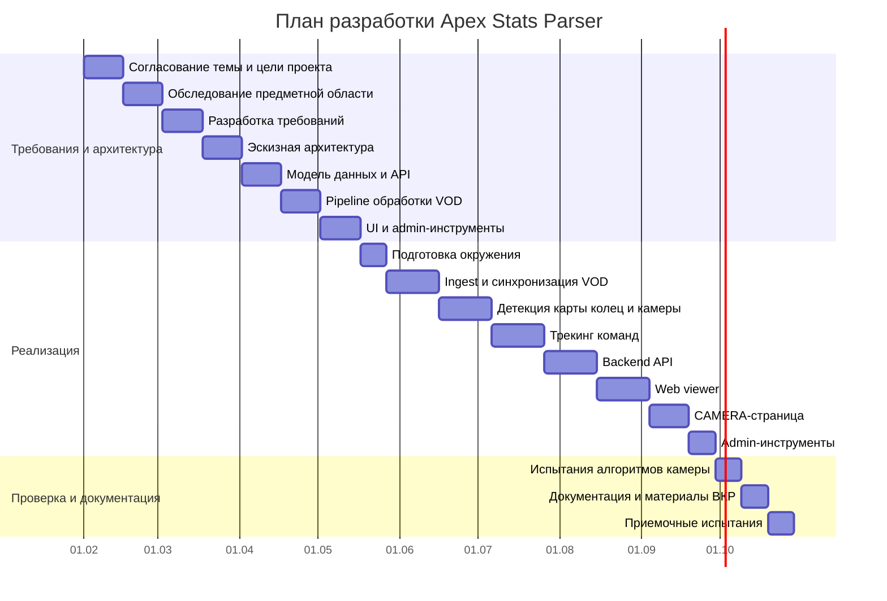
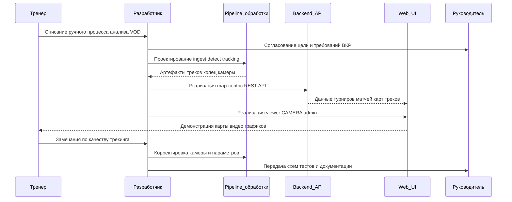
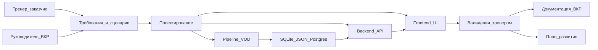

# Глава 4. Организационно-экономические аспекты

## 4.1 Положения и формулы для расчета стоимости программного продукта

В данной главе рассматриваются организационные и экономические аспекты разработки программного продукта Apex Stats Parser. Проект представляет собой систему для автоматизированного анализа перемещений команд в Apex Legends по записям трансляций. Экономический смысл разработки состоит в том, что система должна уменьшить объем ручной работы тренера или аналитика при разборе матчей.

При ручном подходе тренер отслеживает перемещение каждой команды отдельно. Если на одну команду уходит примерно 3 минуты, а в матче участвует 20 команд, то первичная разметка одного матча занимает около 60 минут. Если анализируется серия из 6 карт, то трудозатраты могут достигать 360 минут, то есть около 6 часов. Автоматизированная система не убирает работу тренера полностью, но переносит основную рутинную часть на программную обработку. Тренер после этого тратит время не на механическое отслеживание каждой команды, а на проверку результата и формирование выводов.

Общие затраты на разработку программного продукта складываются из расходов на оплату труда разработчика и затрат на машинное время:

```text
Z_общ = Z_раз + Z_маш
```

где `Z_общ` — общие затраты на разработку, `Z_раз` — расходы по оплате труда разработчика, `Z_маш` — затраты на оплату машинного времени.

Расходы на оплату труда разработчика определяются по формуле:

```text
Z_раз = t_разф * C_раз
```

где `t_разф` — фактические временные затраты на разработку программного продукта, а `C_раз` — средняя часовая оплата труда разработчика.

Средняя часовая оплата труда определяется по формуле:

```text
C_раз = ФЗР_г / n_р
```

где `ФЗР_г` — годовой фонд заработной платы с учетом отчислений, а `n_р` — число рабочих часов в году.

Затраты на машинное время рассчитываются по формуле:

```text
Z_маш = t_маш * C_ПК
```

где `t_маш` — совокупные затраты машинного времени, а `C_ПК` — себестоимость часа работы на ПК.

Таким образом, для расчета общей стоимости разработки необходимо определить трудоемкость работ, среднюю оплату труда разработчика, стоимость часа работы компьютера и расходы на расходные материалы.

## 4.2 Особенности организации разработки

Разработка программного продукта Apex Stats Parser организуется как последовательный проект с контрольными точками. Такой подход удобен для студенческой ВКР, потому что позволяет разделить работу на понятные этапы: анализ предметной области, формирование требований, проектирование, реализация, тестирование и оформление документации.

Проект связан не только с web-разработкой, но и с обработкой видео. Поэтому сначала нужно было разобраться с предметной областью Apex Legends, понять рабочий процесс тренера и определить, какие данные нужны для анализа. После этого были спроектированы основные части системы: pipeline обработки записей, backend API, хранилище данных и web-интерфейс. Затем выполнялась реализация: получение и обработка записей, построение треков команд, настройка камеры, разработка интерфейса и проверка результата.

План разработки представлен в таблице 4.1.

Таблица 4.1 — Базовый план разработки проекта Apex Stats Parser

| № | Задача | Дата исполнения | Исполнитель | Результат |
|---:|---|---|---|---|
| 1 | Согласование темы и цели проекта | T+15 | Руководитель проекта, разработчик | Устав проекта, цель ВКР, состав задач |
| 2 | Обследование предметной области Apex Legends и тренерского анализа | T+30 | Разработчик | Описание проблемы, целевая аудитория, сценарии тренера |
| 3 | Разработка и согласование требований | T+45 | Разработчик, руководитель | Функциональные и нефункциональные требования |
| 4 | Разработка эскизной архитектуры | T+60 | Разработчик | Контекстная схема, C4 Container, общая схема pipeline |
| 5 | Проектирование модели данных и API | T+75 | Разработчик | ER-диаграмма, REST endpoint map, map-centric модель |
| 6 | Проектирование pipeline обработки VOD | T+90 | Разработчик | Схемы ingest, detect, camera, team tracking, ETL |
| 7 | Проектирование интерфейса тренера и admin-инструментов | T+105 | Разработчик | Карта экранов, макеты, схема левого меню |
| 8 | Подготовка окружения разработки и структуры хранения | T+115 | Разработчик | Runtime paths, SQLite/JSON/Postgres стратегия, локальный стенд |
| 9 | Реализация ingest и синхронизации записей | T+135 | Разработчик | Загрузка/синхронизация VOD, клипы матчей, metadata |
| 10 | Реализация детекции карты, колец и камеры | T+155 | Разработчик | `map_start_detection.sqlite`, `camera.sqlite`, debug-артефакты |
| 11 | Реализация анализа и трекинга команд | T+175 | Разработчик | `output/tracks/*.json`, jobs, базовые треки команд |
| 12 | Реализация backend API | T+195 | Разработчик | Catalog API для турниров, матчей, карт, треков, колец и камеры |
| 13 | Реализация web-визуализации | T+215 | Разработчик | Main viewer: карта, команды, таймлайн, кольца |
| 14 | Реализация CAMERA-страницы и синхронизации видео | T+230 | Разработчик | Карта, видео, графики, единый `timeCursor` |
| 15 | Реализация и настройка admin-инструментов | T+240 | Разработчик | HSV, ZONES, POLYGONS, admin-config |
| 16 | Испытания и корректировка алгоритмов камеры | T+250 | Разработчик, эксперт-пользователь | Подбор EMA, anti-latch, pre-jump lock, step-shift |
| 17 | Подготовка эксплуатационной и проектной документации | T+260 | Разработчик | Инструкция запуска, схемы, скриншоты, материалы ВКР |
| 18 | Приемочные испытания и фиксация результатов | T+270 | Разработчик, руководитель | Протокол испытаний, перечень ограничений, план развития |

План предполагает реализацию проекта в течение 270 календарных дней. На практике контрольные точки нужны для того, чтобы не откладывать проверку результата на самый конец разработки. Это особенно важно для данного проекта, потому что качество зависит не только от кода, но и от качества исходных видео, настроек карты, трекинга камеры и визуальной проверки результата.

Начиная с этапа 8 появляется резерв по срокам. Если объем работ нужно сократить, часть функций можно оставить в статусе дальнейшего развития. Например, страница команд, heat-map и live-анализ не входят в обязательный минимум для защиты ВКР. Основными функциями MVP являются обработка VOD, построение треков, backend API, основной viewer, CAMERA-страница и административные настройки.

Диаграмма Ганта для разработки проекта:



Диаграмма последовательности организации разработки:



Диаграмма компонентов разработки:



## 4.3 Расчет временных затрат труда на разработку

Стоимость программного продукта можно определить через затраты времени на разработку с учетом сложности изготовления и затрат на корректировку. Общее число планируемых рабочих часов определяется по формуле:

```text
n_пл = (N' - N_п - N_в) * N'_см
```

где `N'` — общее число дней в исследуемом периоде, `N_п` — число праздничных дней, `N_в` — число выходных дней, `N'_см` — продолжительность смены.

Для расчета принимаются следующие значения:

```text
n_пл = (31 - 4 - 7) * 8 = 160 ч
```

Поправочный коэффициент затрат труда на исследование алгоритма решения задачи определяется так:

```text
K_ти = B / K = 1.2 / 0.8 = 1.5
```

Поправочный коэффициент остальных затрат труда на разработку:

```text
K_п = 1 / K = 1 / 0.8 = 1.25
```

Временные затраты на разработку программного продукта представлены в таблице 4.2.

Таблица 4.2 — Временные затраты на разработку программного продукта

| № | Этап разработки | Плановые затраты, ч | Фактические затраты, ч |
|---:|---|---:|---:|
| 1 | Подготовка и описание задачи | 1,6 | 2 |
| 2 | Исследование алгоритма решения задачи | 4,8 | 7,2 |
| 3 | Разработка алгоритма решения задачи | 16 | 20 |
| 4 | Составление программы | 16 | 20 |
| 5 | Автономная отладка программы на ПК | 80 | 100 |
| 6 | Подготовка документации по задаче | 42 | 52,5 |
| 6.1 | Подготовка материала в рукописи | 24 | 30 |
| 6.2 | Редактирование, печать и оформление документации | 18 | 22,5 |
|  | Итого | 160,4 | 201,7 |

Фактические временные затраты на разработку программного продукта составили:

```text
t_разф = 201.7 ч
```

## 4.4 Расчет средней часовой оплаты труда разработчика

Для определения расходов на оплату труда разработчика сначала рассчитывается месячная оплата труда с учетом надбавок и отчислений. В расчет включаются премия 20%, районный коэффициент 15% и страховые взносы 30%.

```text
ЗП_м = ЗП_осн * (1 + K_доп) * (1 + K_ур) * (1 + K_сввбф)
ЗП_м = 5000 * (1 + 0.20) * (1 + 0.15) * (1 + 0.30) = 8970 руб
```

Годовой фонд заработной платы:

```text
ФЗР_г = ЗП_м * 12
ФЗР_г = 8970 * 12 = 107640 руб
```

Число рабочих часов в году определяется по производственному календарю:

```text
n_р = (N - N_п - N_в) * N_см - N_п * 1
n_р = (366 - 13 - 104) * 8 - 13 * 1 = 1979 ч
```

Средняя часовая оплата программиста:

```text
C_раз = ФЗР_г / n_р = 107640 / 1979 = 54.39 руб/ч
```

Расходы по оплате труда разработчика:

```text
Z_раз = t_разф * C_раз
Z_раз = 201.7 * 54.39 = 10970.46 руб
```

Следовательно, расходы по оплате труда разработчика программы равны `10970.46 руб`.

## 4.5 Расчет затрат на машинное время

Так как разработка программного продукта выполнялась на персональном компьютере, необходимо рассчитать затраты на машинное время. Сначала определяется действительный годовой фонд времени работы ПК:

```text
n_ПК = (N - N_п - N_в) * N_см - N_п * 1 - N_РЕМ
```

Время на профилактические мероприятия:

```text
N_РЕМ = (N - N_п - N_в) * K_д + K_м * 12 + K_г
N_РЕМ = (366 - 13 - 104) * 0.5 + 2 * 12 + 6 = 154.5 ч
```

Годовой полезный фонд времени ПК:

```text
n_ПК = (366 - 13 - 104) * 8 - 13 * 1 - 154.5 = 1824.5 ч
```

Балансовая стоимость ПК:

```text
Ц_ПК = Ц_р * (1 + K_ун)
Ц_ПК = 30000 * (1 + 0.15) = 34500 руб
```

Годовые амортизационные отчисления:

```text
H_a = (1 / T_экс_ПК) * 100% = (1 / 5) * 100 = 20%
Z_ГАМ = Ц_ПК * H_a = 34500 * 0.2 = 6900 руб
```

Затраты на электроэнергию:

```text
Z_ГЭЛ = P_чпк * T_ПК * Ц_эл * K_инт
Z_ГЭЛ = 0.4 * 1824.5 * 2.4 * 0.9 = 1576.37 руб
```

Текущие затраты на эксплуатацию ПК:

```text
Z_ПК = Z_ГАМ + Z_ГЭЛ
Z_ПК = 6900 + 1576.37 = 8476.37 руб
```

Себестоимость часа работы на ПК:

```text
C_ПК = Z_ПК / n_ПК
C_ПК = 8476.37 / 1824.5 = 4.65 руб/ч
```

В ходе разработки машина использовалась на этапах программирования, отладки и подготовки документации. Совокупные затраты машинного времени составляют:

```text
t_маш = t_прф + t_отлф + t_дф
t_маш = 20 + 100 + 52.5 = 172.5 ч
```

Затраты на оплату машинного времени:

```text
Z_маш = t_маш * C_ПК
Z_маш = 172.5 * 4.65 = 802.13 руб
```

Таким образом, затраты на оплату машинного времени составили `802.13 руб`.

## 4.6 Общие затраты на создание программного продукта

Общие затраты на создание программы определяются как сумма затрат на разработку и затрат на оплату машинного времени:

```text
Z_общ = Z_раз + Z_маш
Z_общ = 10970.46 + 802.13 = 11772.59 руб
```

Также учитываются расходные материалы, приведенные в таблице 4.3.

Таблица 4.3 — Расходные материалы

| Статья затрат | Стоимость за единицу, руб | Количество | Общая стоимость, руб |
|---|---:|---:|---:|
| Пользование ресурсами Интернет | 700 | 1 мес. | 700 |
| Бумага | 200 | 1 пач. | 200 |
| Компакт-диск (CD-R) | 20 | 1 шт. | 20 |
| Итого |  |  | 920 |

Итоговые затраты на разработку программного продукта представлены в таблице 4.4.

Таблица 4.4 — Общие затраты на разработку программного продукта

| Статья затрат | Условное обозначение | Числовое значение, руб |
|---|---|---:|
| Общие затраты на создание разработки | `Z_общ` | 11772.59 |
| Расходные материалы | `Z_рм` | 920 |
| Итого | `S_общ` | 12692.59 |

Финальная стоимость с учетом расходных материалов:

```text
S_общ = Z_общ + Z_рм
S_общ = 11772.59 + 920 = 12692.59 руб
```

Следовательно, общая расчетная стоимость разработки программного продукта Apex Stats Parser составляет `12692.59 руб`.

## 4.7 Оценка экономического эффекта

Разработанный программный продукт имеет практическую ценность для тренера или аналитика киберспортивной команды. При ручном подходе первичная разметка одного матча с 20 командами занимает около 60 минут. Если анализируется серия из 6 карт, то трудоемкость может достигать 6 часов.

Система Apex Stats Parser позволяет автоматизировать построение треков и предоставить тренеру готовую визуализацию. После этого человек занимается не ручным покомандным отслеживанием, а проверкой результата и анализом тактических ситуаций. Это позволяет уменьшить количество рутинной работы и быстрее переходить к выводам по матчу.

Кроме экономии времени, система дает дополнительные преимущества. Результаты анализа можно сохранять и повторно использовать. Появляется возможность сравнивать матчи по картам, готовить будущие heat-map, анализировать маршруты команд и снижать вероятность пропуска важных ротаций.

На текущем этапе проект можно рассматривать как MVP-версию аналитического инструмента. В дальнейшем его можно расширить за счет страницы команд, heat-map, live-анализа и улучшенного трекинга камеры. Эти функции могут повысить коммерческую ценность продукта для киберспортивной организации.

Вывод по главе: разработка программного продукта требует затрат на труд разработчика, машинное время и расходные материалы. Итоговая расчетная стоимость составила `12692.59 руб`. При этом продукт решает практическую задачу сокращения ручного анализа матчей Apex Legends и может быть использован как основа для дальнейшего коммерческого развития.
