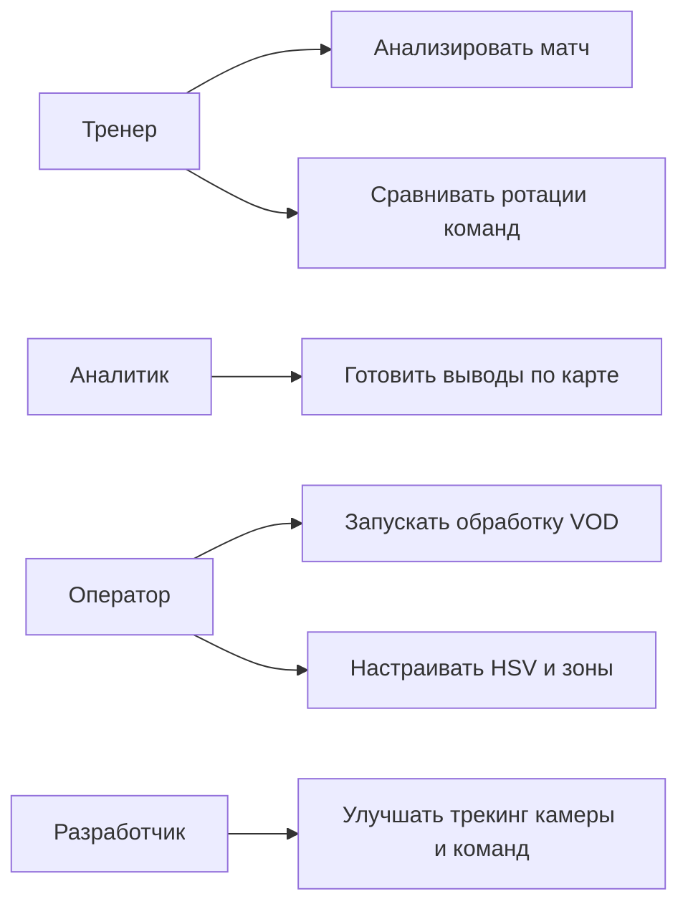
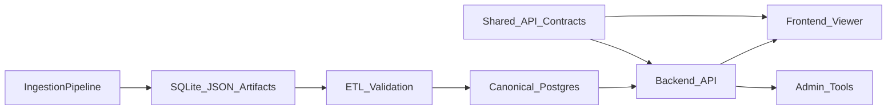
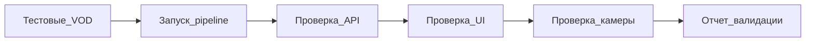
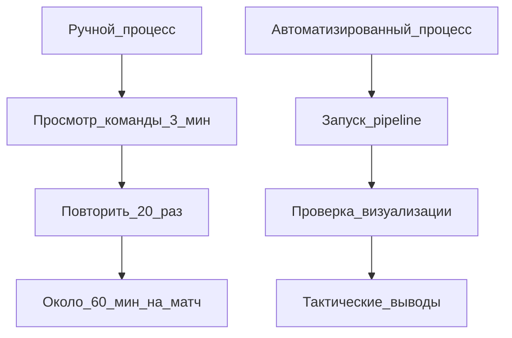
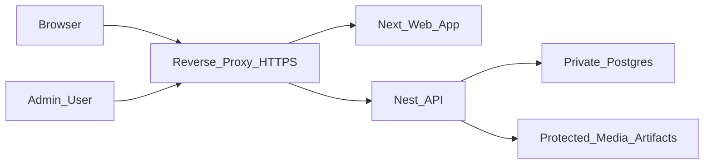

# Подробный план ВКР по проекту Apex Stats Parser

Документ описывает, как развернуть дипломную работу объемом около 60 страниц A4 14 шрифтом по проекту автоматизированного анализа перемещений команд в Apex Legends. План опирается на текущий код проекта, файл `docs/diploma/diploma-diagrams.md` и план структурной реорганизации `.cursor/plans/project_structure_revamp_54b2ad6b.plan.md`.

## 0. Рабочая формулировка темы

Рекомендуемая тема: **«Разработка программной системы автоматизированного анализа перемещений команд в Apex Legends по записям турнирных трансляций»**.

Суть проекта: система принимает записи трансляций крупных турниров Apex Legends, извлекает данные о карте, командах, кольцах и камере, сохраняет результаты анализа и отображает их в web-интерфейсе. Целевой пользователь — тренер или аналитик киберспортивной организации, которому нужно ускорить разбор матчей и снизить объем ручной работы.

Основная проблема: ручное отслеживание одной команды по VOD занимает около 3 минут. В матче участвует до 20 команд, поэтому первичная ручная разметка одного матча может занимать около 60 минут без учета перепроверки и сравнения с другими картами. Система решает эту проблему через автоматический трекинг команд, визуализацию траекторий, синхронизацию с видео и инструменты настройки качества анализа.

## 1. Рекомендуемая структура и объем

Введение: 3-4 страницы.

Глава 1. Разработка требований к системе: 12-14 страниц.

Глава 2. Проектирование системы: 18-22 страницы.

Глава 3. Особенности реализации и тестирования: 14-16 страниц.

Глава 4. Организационно-экономические аспекты: 4-5 страниц.

Глава 5. Информационная безопасность и защита информации: 3-4 страницы.

Заключение: 2 страницы.

Приложения: схемы, скриншоты, примеры JSON/API, тест-кейсы, фрагменты кода.

## 2. Введение

### О чем писать

Во введении нужно показать, почему задача актуальна не как учебная визуализация, а как практический инструмент для киберспортивной организации. Apex Legends — игра с большим количеством команд, высокой скоростью принятия решений и важной ролью макро-ротаций по карте. Тренер анализирует, как команды занимают зоны, когда начинают движение, где допускают ошибку позиционирования, какие маршруты повторяются от матча к матчу.

Следует подчеркнуть, что обычная запись трансляции не предоставляет готовых координат команд. Данные приходится извлекать из визуального потока: видео, HUD, миникарты, кольца и трансляционной камеры. Из-за этого проект сочетает обработку видео, хранение данных, backend API и интерактивный frontend.

Цель ВКР: разработать программную систему, позволяющую автоматически получать и визуализировать перемещения команд по записям турнирных трансляций Apex Legends.

Задачи ВКР:
- изучить предметную область киберспортивной аналитики Apex Legends;
- выявить требования тренера/аналитика к системе;
- спроектировать pipeline обработки видео и архитектуру web-приложения;
- реализовать хранение и API для турниров, матчей, карт, треков, колец и камеры;
- реализовать визуализацию треков и синхронизацию карты, таймлайна, графиков и видео;
- разработать инструменты настройки HSV, зон, полигонов и камеры;
- провести проверку работоспособности и оценить эффект сокращения ручного труда.

Объект исследования: процесс анализа турнирных трансляций Apex Legends.

Предмет исследования: алгоритмы и программные средства извлечения, хранения и визуализации данных о перемещении команд.

Практическая значимость: система может быть использована тренером киберспортивной команды для ускорения анализа VOD, накопления базы матчей и подготовки тактических выводов.

### Что приложить

Схема: «Контекстная схема системы» из `docs/diploma/diploma-diagrams.md`.

Скриншот: главная страница с интерактивной картой, списком команд и таймлайном.

Скриншот: CAMERA-страница с картой, видео и графиками.

## 3. Глава 1. Разработка требований к системе

### 1.1 Выявление требований

#### Что раскрыть

Нужно описать заинтересованные стороны:
- тренер команды: хочет быстрее понимать ротации, ошибки позиционирования и поведение соперников;
- аналитик: готовит материалы по матчам, сравнивает карты, ищет повторяющиеся паттерны;
- оператор системы: запускает обработку VOD, проверяет корректность распознавания, настраивает зоны и HSV;
- разработчик: поддерживает pipeline, API, UI и качество трекинга;
- киберспортивная организация: получает коммерческую ценность за счет ускорения аналитического процесса.

Далее нужно описать текущий ручной процесс. Тренер открывает запись матча, выбирает команду, смотрит ее положение на карте, вручную фиксирует перемещения и повторяет процесс для всех команд. Если на одну команду тратится около 3 минут, то 20 команд требуют около 60 минут только на первичный проход одного матча. При серии из 6 карт это уже около 6 часов ручной первичной разметки.

Ограничения предметной области:
- Apex Legends содержит до 20 команд на карте;
- трансляционная камера может смещаться и масштабироваться;
- данные команды не доступны напрямую через официальный API матча;
- качество VOD, HUD и оверлеев влияет на распознавание;
- карты и зоны требуют настройки и валидации.

#### Функциональные требования

Система должна:
- загружать или принимать записи трансляций;
- хранить сведения о турнирах, матчах и картах;
- определять карту и временные границы игрового фрагмента;
- извлекать данные о кольцах и положении камеры;
- формировать треки команд по временной шкале;
- предоставлять REST API для web-клиента;
- отображать карту, команды, траектории и таймлайн;
- синхронизировать карту, видео и графики;
- позволять настраивать HSV, зоны, полигоны и параметры камеры;
- сохранять результаты анализа в Postgres, SQLite или JSON-артефактах;
- предоставлять инструменты диагностики качества камеры и треков.

#### Нефункциональные требования

Система должна:
- быть воспроизводимой: одинаковые входные данные и настройки дают одинаковые артефакты;
- быть расширяемой под новые карты, турниры и форматы трансляций;
- быть устойчивой к неполным данным через fallback SQLite/JSON;
- иметь удобный web-интерфейс для тренера;
- поддерживать отладку алгоритмов через графики и параметры;
- иметь понятную структуру данных для дальнейшей коммерческой доработки.

#### Схемы и скриншоты

Схема вариантов использования:

Скриншоты:
- главная страница просмотра матча;
- CAMERA-страница;
- HSV/ZONES/POLYGONS как инструменты подготовки данных.

### 1.2 Анализ требований

#### Что раскрыть

Требования нужно разделить на MVP и перспективные доработки.

MVP:
- обработка VOD;
- получение карты, колец, камеры и командных треков;
- сохранение результатов;
- API для чтения данных;
- визуализация карты и таймлайна;
- CAMERA-страница для синхронизации карты, видео и графиков;
- admin-инструменты для настройки HSV, зон и полигонов.

Перспективные задачи:
- страница команд с профилем команды;
- heat-map для каждой команды по каждой карте;
- быстрый анализ в live-режиме;
- улучшение трекинга команд через более точный трекинг камеры;
- переход к модульной архитектуре backend и контура `tools/algs-collector`;
- единые API-контракты и canonical data model.

Live-анализ нужно вынести в перспективу, потому что он требует обработки кадров с малой задержкой, очередей, incremental-обновления UI и более строгих требований к вычислительным ресурсам. Для дипломного MVP логичнее использовать batch-анализ VOD, так как он дает воспроизводимый результат и проще тестируется.

#### Что приложить

Схема: end-to-end поток из `docs/diploma/diploma-diagrams.md`.

Расчет экономии времени:
- 1 команда = 3 минуты ручного просмотра;
- 20 команд = 60 минут на матч;
- 6 карт = 360 минут, то есть около 6 часов первичной ручной работы;
- автоматизация сокращает ручной этап до запуска обработки, проверки результата и анализа готовых визуализаций.

### 1.3 Спецификация требований

#### Основные сценарии

Сценарий 1: анализ матча тренером.
1. Тренер открывает web-приложение.
2. Выбирает турнир, матч и карту.
3. Видит интерактивную карту с треками команд.
4. Перемещает таймлайн и смотрит изменение позиций.
5. Сравнивает поведение команд относительно кольца.
6. Делает выводы по ротациям и ошибкам позиционирования.

Сценарий 2: проверка камеры.
1. Оператор открывает CAMERA-страницу.
2. Выбирает турнир, матч и карту.
3. Сравнивает карту с видео.
4. Смотрит графики `cameraX`, `cameraY`, `zoomRatio`, jump-событий.
5. Настраивает EMA, anti-latch и pre-jump lock.
6. Проверяет, как меняется отображение треков после camera-shift.

Сценарий 3: подготовка карты.
1. Оператор открывает HSV/ZONES/POLYGONS.
2. Настраивает цветовые диапазоны команд.
3. Проверяет зоны карты и полигоны.
4. Сохраняет настройки.
5. Повторно запускает анализ или проверяет визуализацию.

#### Входные данные

- mp4-записи трансляций;
- метаданные турниров, матчей и карт;
- настройки HSV;
- зоны и полигоны карты;
- настройки runtime paths;
- артефакты SQLite/JSON от pipeline.

#### Выходные данные

- треки команд;
- данные колец;
- данные камеры;
- конфигурации карт;
- API-ответы для frontend;
- интерактивная визуализация;
- графики качества камеры.

#### Критерии приемки

- пользователь может выбрать турнир, матч и карту;
- карта и видео синхронизируются по времени;
- треки команд отображаются на карте;
- графики камеры реагируют на текущий `timeCursor`;
- API возвращает данные без ручного доступа к SQLite/JSON;
- настройки камеры позволяют уменьшить шумные срабатывания;
- система демонстрирует сокращение ручного анализа по сравнению с исходным процессом.

## 4. Глава 2. Проектирование системы

### 2.1 Эскизное проектирование

#### Что раскрыть

Система делится на четыре крупные части:
- ingestion и analysis pipeline;
- слой хранения данных;
- backend API;
- frontend/admin UI.

Pipeline получает VOD, нарезает или синхронизирует записи, определяет начало карты, извлекает кольца, камеру и команды. Backend скрывает физические источники данных и предоставляет map-centric API. Frontend отображает эти данные в интерфейсе тренера. Admin-интерфейс используется для настройки карт и диагностики.

Важно объяснить текущий и целевой варианты архитектуры. Текущий вариант сочетает Postgres, SQLite и JSON, потому что проект развивался итеративно и требовал быстрого исследования алгоритмов. Целевой вариант из плана реорганизации: Postgres как canonical storage, idempotent ETL, модульный backend, общий API contract, разбиение tools/algs-collector на pipeline-модули.

#### Схемы

Использовать:
- контекстную схему системы;
- C4 Container;
- общую end-to-end схему проекта из `project_structure_revamp`;
- схему каркаса директорий проекта.

Дополнительная схема целевой архитектуры:

### 2.2 Детальное проектирование pipeline обработки видео

#### Что раскрыть

Модуль `map_vod_ingest.py` получает VOD, использует `yt-dlp` и `ffmpeg`, сохраняет клипы и метаданные в `output/youtube_ingest/tournaments.sqlite`.

Модуль `vps_records_sync.py` доставляет mp4-клипы с VPS, если обработка или скачивание выполнялись удаленно.

Модуль `detect_map_start.py` определяет начало карты, работает с OCR-зонами, кольцами и картой. Он вызывает `rings_detector.py` и `camera_tracker.py`. Результаты попадают в `output/map_start_detection.sqlite`, `output/camera.sqlite`, `output/map_start_text` и debug-артефакты.

Модуль `batch_analyze.py` анализирует команды, использует настройки HSV, зоны и данные map-start. Результат сохраняется в `output/tracks/*.json`, `output/jobs.json` и может быть синхронизирован в Postgres.

ETL-скрипты синхронизируют SQLite/JSON-артефакты с canonical Postgres.

#### Схемы

Использовать из `project_structure_revamp`:
- VOD ingest;
- VPS sync;
- map start/rings/camera/OCR;
- team tracking;
- DB/artifacts storage.

#### Что приложить

- скриншот структуры `output/`;
- фрагмент JSON из `output/tracks`;
- фрагмент структуры `CameraTrack`;
- пример CLI-команды запуска анализа;
- пример логов или job status.

### 2.3 Детальное проектирование backend и данных

#### Что раскрыть

Backend реализован на NestJS. Основной модуль для пользовательских данных — `CatalogModule`. `CatalogController` содержит endpoint-ы:
- `/catalog/tournaments`;
- `/catalog/tournaments/:tournamentId/matches`;
- `/catalog/matches/:matchId/maps`;
- `/catalog/maps/:mapId/teams`;
- `/catalog/maps/:mapId/tracks`;
- `/catalog/maps/:mapId/rings`;
- `/catalog/maps/:mapId/camera`;
- `/catalog/maps/:mapId/background`;
- `/catalog/maps/:mapId/video`;
- `/catalog/maps/:mapId/admin-config`;
- `/catalog/maps/:mapId/zones`;
- `/catalog/maps/:mapId/text-zones`.

`CatalogService` выполняет чтение из Postgres, SQLite и файловых артефактов. В текущем состоянии он совмещает несколько обязанностей, что допустимо для MVP, но в дипломе нужно честно обозначить как архитектурное ограничение и направление развития.

Ключевой принцип API: `mapId` является агрегатным ключом. Почти все runtime-данные страницы CAMERA и viewer запрашиваются относительно выбранной карты.

#### Схемы

Использовать:
- компонентную схему backend;
- ER-диаграмму доменных сущностей;
- map-centric logical links;
- карту REST endpoint-ов;
- sequence загрузки CAMERA;
- sequence fallback-загрузки видео.

#### Что приложить

- скриншот JSON ответа `/catalog/maps/:mapId/tracks`;
- скриншот JSON ответа `/catalog/maps/:mapId/camera`;
- фрагмент кода `CatalogController`;
- фрагмент кода `getMapVideoPath`.

### 2.4 Детальное проектирование frontend и UX

#### Что раскрыть

Frontend построен на Next.js и React. Основной entry point главной страницы — `apps/web/app/page.tsx`. CAMERA-страница находится в `apps/web/app/admin/zoom/page.tsx`. Основное состояние вынесено в `useMatchViewerState`.

`useMatchViewerState` отвечает за:
- список турниров, матчей, карт и команд;
- выбранный турнир/матч/карту;
- загрузку треков, колец и камеры;
- `timeCursor`;
- состояние воспроизведения;
- параметры сглаживания камеры;
- настройки рендера треков и кольца.

`BroadcastViewer` собирает layout страницы: левое меню, выбор турнира и карты, карту, команды, транспорт-панель, графики, настройки. `MapPlayer` выполняет Canvas-рендер карты, командных треков, колец и camera-shift.

CAMERA-страница отличается тем, что команды скрыты, карта и видео расположены рядом, графики находятся ниже, а настройки вынесены в левую панель.

#### Схемы

Использовать:
- компонентную схему frontend;
- runtime-поток CAMERA;
- поток обновления `timeCursor`;
- карту экранов и режимов;
- карту левого меню;
- state diagram воспроизведения.

#### Скриншоты

- Main viewer;
- CAMERA карта+видео;
- CAMERA графики;
- настройки camera smoothing;
- HSV page;
- ZONES page;
- POLYGONS page;
- DATABASE/Workspace при необходимости.

### 2.5 Проектирование алгоритмов камеры и треков

#### Что раскрыть

Ключевая техническая часть диплома — стабилизация камеры и коррекция треков. Трансляционная камера может смещаться, масштабироваться и давать ложные скачки. Если это не учитывать, траектории команд будут визуально расходиться с картой и видео.

EMA сглаживание используется для подавления шума `cameraX`, `cameraY`, `zoomRatio`. Ring noise tuning позволяет задавать разную силу сглаживания для разных колец. Ранние кольца могут быть более шумными, поэтому для них нужен расширенный диапазон.

Anti-latch решает проблему длинного хвоста: если сглаженная камера долго расходится с центром кольца при малом движении raw-сигнала, алгоритм мягко возвращает ее к более правдоподобной позиции.

Pre-jump lock удерживает камеру в допустимом коридоре до первого подтвержденного скачка. Это уменьшает ложные движения до реального изменения камеры.

Step-shift применяет кумулятивную трансформацию к командным точкам после jump-событий: если скачок камеры произошел в 8:30, то все точки после 8:30 отображаются в новой системе координат.

#### Схемы

Использовать:
- EMA + ring noise tuning;
- anti-latch XY/zoom;
- pre-jump lock/unlock;
- step-shift transformation;
- метрики качества камеры.

#### Скриншоты

- графики до/после сглаживания;
- маркеры jump-событий;
- карта с выключенным camera-shift;
- карта с включенным camera-shift;
- панель настроек anti-latch/pre-jump lock.

### 2.6 Интерфейсное проектирование

#### Что раскрыть

Интерфейс проектировался как инструмент тренера, а не как демонстрационная карта. Поэтому важны:
- быстрый выбор турнира, матча и карты;
- видимость команд и их треков;
- единый таймлайн;
- синхронизация с видео;
- диагностика камеры;
- единый стиль левого меню.

Figma использовалась для фиксации и переноса текущего дизайна. Меню унифицировано по страницам: Main, HSV, Zones, Polygons, CAMERA. На CAMERA-странице карта и видео отображаются рядом, потому что это главный экран сверки качества трекинга.

#### Что приложить

- скриншоты сайта;
- скриншоты Figma, если доступны;
- схема экранов;
- схема левого меню;
- краткое описание UX-сценария тренера.

## 5. Глава 3. Особенности реализации и тестирования

### 3.1 Выбор и обоснование средств реализации

Python выбран для видеообработки, так как дает доступ к OpenCV, OCR, обработке кадров и CLI-пайплайнам.

NestJS выбран для backend API, так как поддерживает модульную архитектуру, контроллеры, сервисы и TypeScript-контракты.

Next.js/React выбран для frontend, так как приложение требует сложного состояния, интерактивных компонентов, Canvas-рендера и синхронизации UI.

PostgreSQL выбран как целевой canonical storage для структурированных данных. SQLite и JSON используются как артефакты обработки, удобные для локальной разработки, debug и fallback.

Mermaid используется для описания архитектуры, потоков данных, алгоритмов и тестового контура. Figma используется для переноса и согласования интерфейса.

### 3.2 Особенности реализации

#### Что раскрыть

Главная особенность frontend — `timeCursor` как единый источник времени. Он управляет картой, таймлайном, графиками и видеоплеером. При воспроизведении `timeCursor` изменяется через animation frame, а при seek меняется вручную пользователем или событием видеоплеера.

Главная особенность backend — map-centric API и гибридная стратегия чтения. Backend может читать из Postgres, SQLite и файлов, нормализуя ответ для frontend.

Главная особенность CAMERA-страницы — устойчивый подбор видеоисточника. Сначала используется endpoint `/catalog/maps/:mapId/video`, затем fallback-кандидаты. Это решает проблему 404 и несогласованных путей к mp4.

Главная особенность алгоритмов — сайт может тестировать параметры камеры без полного повторного анализа команд. Пользователь меняет EMA, anti-latch, pre-jump lock и camera-shift, после чего сразу видит результат на карте и графиках.

Архитектурные ограничения текущего состояния:
- `CatalogService` слишком крупный;
- `admin/index.html` является большим статическим файлом;
- часть типов frontend/backend дублируется;
- есть смешанный режим данных Postgres/SQLite/JSON;
- tools/algs-collector содержит мощные, но монолитные скрипты.

Перспективная реализация:
- общий API contract;
- разделение backend на bounded contexts;
- canonical Postgres model;
- идемпотентный ETL;
- разбиение tools/algs-collector на модули `config`, `ingest`, `detect`, `sync`, `enrich`;
- перенос admin UI в модульный React.

### 3.3 Особенности тестирования

#### Что раскрыть

Функциональное тестирование API:
- получение турниров;
- получение матчей;
- получение карт;
- получение команд карты;
- получение треков;
- получение колец;
- получение камеры;
- получение видео и background;
- чтение/запись admin-config, zones, text-zones.

UI-тестирование:
- выбор турнира/матча/карты;
- play/pause;
- seek по таймлайну;
- синхронизация видео и карты;
- корректное отображение кольца;
- переключение команд;
- изменение настроек камеры;
- fullscreen-режим.

Алгоритмическая валидация:
- сравнение jitter до/после EMA;
- подсчет ложных unlock;
- проверка anti-latch hits;
- визуальное сравнение с видео;
- проверка step-shift после jump-событий.

#### Тестовый контур

#### Что собрать

- 3-5 тестовых карт с разными условиями;
- список ручных тест-кейсов;
- скриншоты успешных API-ответов;
- скриншоты UI-состояний;
- сравнение ручного и автоматизированного времени анализа;
- примеры проблем трекинга и их решения настройками камеры.

## 6. Глава 4. Организационно-экономические аспекты

### Что раскрыть

Целевая аудитория продукта:
- профессиональные Apex Legends команды;
- тренеры и аналитики;
- киберспортивные организации;
- аналитические отделы и скауты.

Экономический эффект строится на сокращении времени ручного анализа. Если тренер тратит 3 минуты на одну команду, то 20 команд требуют около 60 минут на матч. При серии из 6 карт это около 360 минут, то есть 6 часов ручной первичной работы. Даже если автоматическая обработка занимает время, она может выполняться пакетно, а человек тратит время только на проверку результата и аналитические выводы.

Коммерческая ценность:
- ускорение подготовки к соперникам;
- накопление базы карт и ротаций;
- снижение зависимости от ручной разметки;
- возможность строить будущие heat-map и профили команд;
- потенциальное преимущество на тренировках и подготовке к турнирам.

Модель внедрения:
- локальный инструмент для одной команды;
- пилот для организации;
- SaaS с загрузкой VOD;
- кастомная аналитическая платформа с закрытым доступом.

Риски:
- изменения HUD/оверлеев турниров;
- разное качество видео;
- необходимость ручной калибровки;
- юридические ограничения на использование трансляций;
- вычислительные затраты при масштабировании.

### Схема ручного и автоматизированного процесса

### Что приложить

- расчет экономии времени;
- roadmap коммерциализации;
- описание MVP и будущих платных функций;
- список затрат на разработку, хранение, вычисления и поддержку.

## 7. Глава 5. Информационная безопасность и защита информации

### Что раскрыть

Обрабатываемые данные:
- публичные записи трансляций;
- метаданные матчей и карт;
- результаты анализа команд;
- настройки HSV/зон/камеры;
- стратегические выводы тренера.

Чувствительные данные:
- подготовленные heat-map;
- частотные маршруты команды;
- выводы о слабых местах соперников;
- приватные настройки аналитики;
- внутренние отчеты команды.

Угрозы:
- несанкционированный доступ к аналитике;
- утечка стратегических данных команды;
- подмена mp4 или JSON-артефактов;
- изменение admin-config/zones;
- открытый доступ к API без авторизации;
- утечка секретов БД или API.

Меры защиты:
- HTTPS и reverse proxy в production;
- закрытый доступ к Postgres;
- авторизация для admin и API;
- разграничение ролей тренер/оператор/admin;
- хранение секретов в `.env`;
- аудит изменений конфигурации;
- backup БД и артефактов;
- ограничение доступа к media folders.

### Схема границ доверия

### Что приложить

- список endpoint-ов, которые нужно закрыть авторизацией;
- описание ролей;
- схема production deployment;
- краткая модель угроз для admin-функций.

## 8. Заключение

В заключении нужно показать, что цель ВКР достигнута: создана система, которая автоматизирует важную часть тренерского анализа Apex Legends. Она связывает pipeline обработки видео, хранение данных, API, web-интерфейс, инструменты настройки и визуализацию камеры.

Итоговые результаты:
- разработан pipeline получения и обработки VOD;
- реализованы структуры хранения турниров, матчей, карт, треков, колец и камеры;
- реализован backend API;
- реализован web-интерфейс для анализа матчей;
- реализована CAMERA-страница с синхронизацией карты, видео и графиков;
- подготовлены admin-инструменты HSV/ZONES/POLYGONS;
- описаны алгоритмы EMA, anti-latch, pre-jump lock и step-shift;
- подготовлены схемы архитектуры, данных, API, UI, deployment и тестирования.

Дальнейшие направления:
- страница команд;
- heat-map по каждой команде и карте;
- быстрый live-анализ;
- улучшение трекинга команд через более точный camera tracking;
- архитектурная реорганизация по plan `project_structure_revamp`;
- коммерческая упаковка для пилота в киберспортивной организации.

## 9. Чеклист материалов для ВКР

### Скриншоты интерфейса

- Main viewer: карта, команды, таймлайн.
- CAMERA: карта и видео рядом.
- CAMERA: графики камеры и маркеры событий.
- CAMERA: панель настроек EMA/anti-latch/pre-jump.
- HSV: настройка цветовых диапазонов.
- ZONES: управление зонами.
- POLYGONS: управление полигонами.
- DATABASE/Workspace при необходимости.
- Figma-макет или captured layout, если доступен.

### Схемы

Из `docs/diploma/diploma-diagrams.md`:
- контекстная схема;
- C4 Container;
- component frontend;
- component backend;
- end-to-end data flow;
- CAMERA runtime flow;
- `timeCursor` flow;
- ER diagram;
- REST endpoint map;
- sequence CAMERA load;
- sequence video fallback;
- EMA;
- anti-latch;
- pre-jump lock;
- step-shift;
- UI screens map;
- playback state diagram;
- dev/prod deployment;
- test contour;
- camera quality metrics.

Из `project_structure_revamp`:
- общая end-to-end блок-схема проекта;
- каркас проекта по директориям;
- VOD ingest;
- VPS sync;
- detect map start/rings/camera/OCR;
- team tracking;
- DB/artifacts storage;
- целевая архитектура реорганизации.

### Примеры данных

- фрагмент `output/tracks/*.json`;
- пример `CameraTrack`;
- пример `RingPoint`;
- пример API `/catalog/maps/:mapId/tracks`;
- пример API `/catalog/maps/:mapId/camera`;
- пример `admin_map_settings.json`;
- пример `zones/*.zones.json`;
- пример `text_zones/*.text-zones.json`.

### Метрики и расчеты

- ручная разметка: 3 минуты на команду;
- 20 команд: 60 минут на матч;
- 6 карт: 360 минут или 6 часов;
- метрики камеры: jitter, false unlock, anti-latch hits, visual coherence;
- метрики UI: успешность выбора карты, корректность seek, синхронизация video/map/charts;
- метрики API: успешность endpoint-ов, время ответа на основные GET-запросы.

## 10. Что еще стоит сделать для проекта

Для защиты ВКР:
- собрать финальные скриншоты UI в одном стиле;
- экспортировать Mermaid-схемы в PNG/SVG;
- подготовить 3-5 тестовых кейсов VOD;
- зафиксировать таблицу ручных тест-кейсов;
- подготовить до/после сравнение времени анализа;
- написать инструкцию локального запуска;
- подготовить glossary терминов.

Для продукта:
- реализовать страницу команд;
- реализовать heat-map по команде и карте;
- добавить быстрый live-анализ;
- улучшить camera tracking;
- автоматизировать оценку качества трекинга;
- вынести общие API-типы в shared contracts;
- разделить `CatalogService` на доменные сервисы;
- сделать Postgres canonical source-of-truth;
- сделать ETL идемпотентным;
- перенести admin UI из большого HTML в React-модули.

## 11. Каркас приложений

Приложение А: архитектурные схемы.

Приложение Б: схемы потоков данных и API.

Приложение В: алгоритмические схемы камеры.

Приложение Г: скриншоты интерфейса.

Приложение Д: примеры JSON/API.

Приложение Е: тест-кейсы и результаты проверки.

Приложение Ж: инструкция запуска локального стенда.
