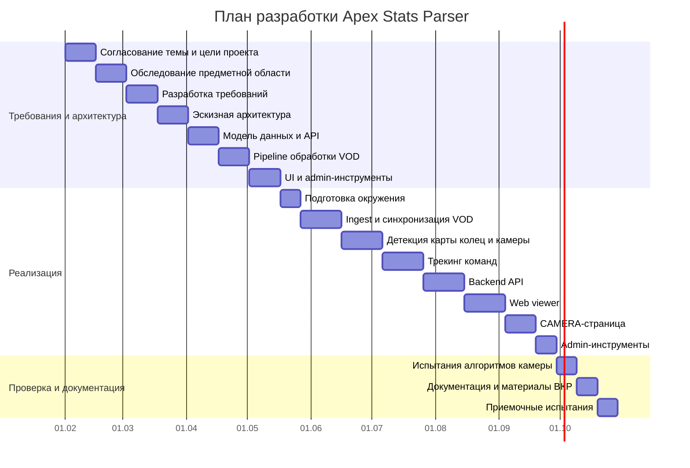
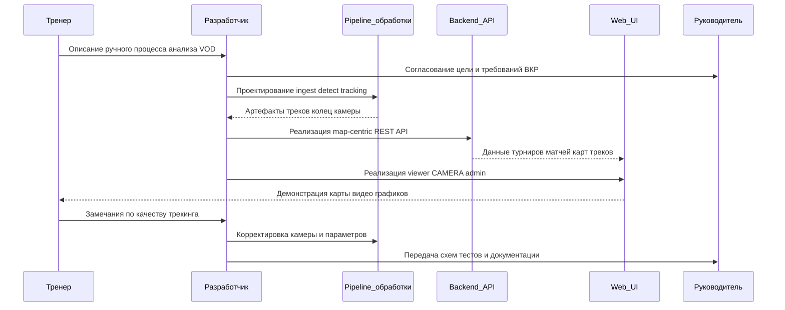
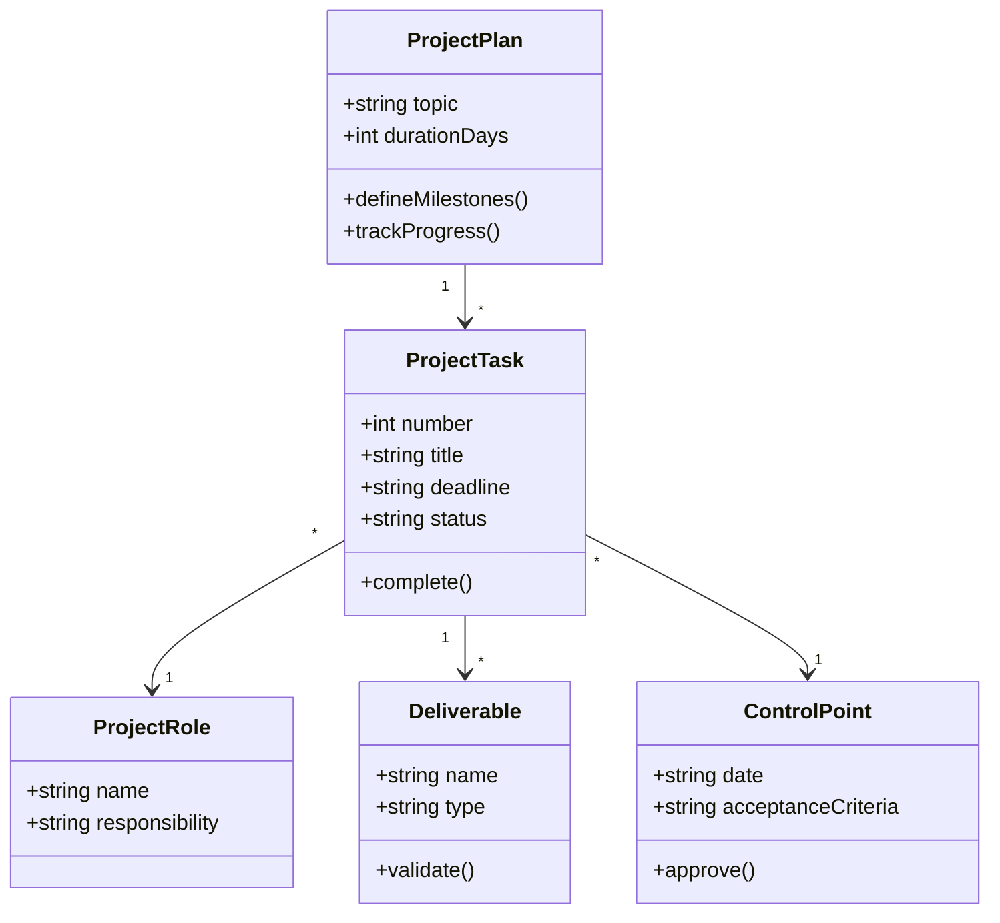
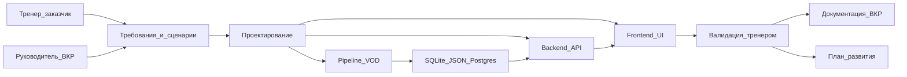

# Метрики, расчеты и оценка эффективности для ВКР

Документ содержит численные ориентиры и показатели качества для разделов «Тестирование», «Организационно-экономические аспекты» и «Заключение».

## 1. Расчет экономии времени

Исходная оценка ручного процесса:
- на отслеживание одной команды по записи трансляции уходит около 3 минут;
- в матче Apex Legends участвует до 20 команд;
- первичная ручная разметка одного матча занимает около 60 минут.

Формула:

```text
T_manual_match = N_teams * T_team
T_manual_match = 20 * 3 = 60 минут
```

Для серии из 6 карт:

```text
T_manual_series = N_maps * T_manual_match
T_manual_series = 6 * 60 = 360 минут = 6 часов
```

Для 5 матчей по 6 карт:

```text
T_manual_batch = 5 * 6 * 60 = 1800 минут = 30 часов
```

В тексте ВКР важно не утверждать, что система полностью убирает работу тренера. Корректная формулировка: система переносит труд с ручного покомандного отслеживания на запуск обработки, проверку результата и тактическую интерпретацию готовой визуализации.

## 2. Модель сравнения ручного и автоматизированного процесса

Ручной процесс:
- открыть VOD;
- выбрать команду;
- отслеживать положение команды на карте;
- вручную фиксировать перемещения;
- повторить для всех 20 команд;
- отдельно сопоставить результат с кольцами и таймингами;
- подготовить выводы.

Автоматизированный процесс:
- загрузить или выбрать VOD;
- запустить pipeline обработки;
- открыть готовую карту;
- проверить треки и спорные места;
- использовать CAMERA-графики для диагностики;
- подготовить выводы по ротациям.

Качественный эффект:
- меньше повторяющейся ручной работы;
- единое отображение всех команд;
- возможность возвращаться к любому таймингу;
- сопоставление треков с видео;
- сохранение результатов для последующего сравнения.

## 3. Метрики качества трекинга команд

### Полнота трека

Что измеряет: насколько много временного интервала карты покрыто точками команды.

Возможная формула:

```text
TrackCoverage = seconds_with_points / total_match_seconds
```

Как использовать в дипломе: показать, что трек не должен состоять из отдельных случайных точек; он должен покрывать значимую часть матча.

### Стабильность трека

Что измеряет: отсутствие резких ложных скачков между соседними точками.

Признаки проблемы:
- слишком большие расстояния между соседними точками;
- линия «телепортируется» через карту;
- точки выходят за ожидаемую область.

Можно описать без сложной математики: система использует порог разрыва линии трека, чтобы не рисовать ложные соединения между удаленными точками.

### Согласованность с видео

Что измеряет: соответствует ли положение команды на карте тому, что видно на VOD в тот же момент времени.

Как проверять:
- открыть CAMERA-страницу;
- выбрать спорный тайминг;
- сверить карту, видео и графики;
- зафиксировать результат как ручную экспертную оценку.

## 4. Метрики качества камеры

Камера важна, потому что ошибки camera tracking влияют на отображение командных треков. В ВКР можно использовать следующие метрики.

### Jitter

Что измеряет: дрожание сглаженной камеры в периоды, когда реального движения быть не должно.

Упрощенная идея:

```text
JitterXY = average(distance(camera_t, camera_t-1))
```

Ожидаемый результат после сглаживания: jitter уменьшается, но без чрезмерного запаздывания на реальных скачках.

### False unlock count

Что измеряет: сколько раз pre-jump lock снялся до реального события движения камеры.

Интерпретация:
- меньше false unlock — стабильнее ранняя фаза;
- слишком строгие параметры могут пропустить реальный jump;
- нужен баланс между стабильностью и реакцией.

### Anti-latch hits

Что измеряет: сколько раз anti-latch вмешался в траекторию камеры.

Интерпретация:
- если hits много, raw/EMA сигнал часто создает длинные хвосты;
- если hits нет, возможно, anti-latch не нужен или пороги слишком строгие;
- полезно сравнивать hits с визуальной картиной на графиках.

### Visual coherence

Что измеряет: согласованность карты, видео и графиков.

Оценка может быть экспертной:
- «корректно» — карта и видео совпадают на ключевых таймингах;
- «сомнительно» — есть малые расхождения;
- «ошибка» — трек явно смещен или скачок камеры обработан неверно.

## 5. Метрики UI и API

### UI

Проверяемые свойства:
- выбор турнира, матча и карты работает;
- данные обновляются после выбора карты;
- play/pause меняет состояние;
- seek меняет карту, графики и видео;
- CAMERA-страница сохраняет синхронизацию;
- fullscreen работает;
- настройки камеры дают визуально проверяемый эффект.

### API

Проверяемые endpoint-ы:
- `/catalog/tournaments`;
- `/catalog/tournaments/:tournamentId/matches`;
- `/catalog/matches/:matchId/maps`;
- `/catalog/maps/:mapId/teams`;
- `/catalog/maps/:mapId/tracks`;
- `/catalog/maps/:mapId/rings`;
- `/catalog/maps/:mapId/camera`;
- `/catalog/maps/:mapId/background`;
- `/catalog/maps/:mapId/video`;
- `/catalog/maps/:mapId/admin-config`;
- `/catalog/maps/:mapId/zones`;
- `/catalog/maps/:mapId/text-zones`.

Критерии:
- endpoint возвращает успешный статус;
- структура ответа соответствует ожиданиям frontend;
- пустые или неполные данные не ломают UI;
- видео и background корректно отдаются как файлы.

## 6. Экономический эффект

Основной эффект — экономия времени тренера/аналитика и повышение повторяемости анализа.

Пример формулировки для ВКР:

«При ручном подходе первичная разметка одного матча с 20 командами занимает около 60 минут. При серии из 6 карт трудоемкость достигает около 6 часов. Разрабатываемая система автоматизирует построение треков и предоставляет тренеру готовую интерактивную визуализацию, поэтому человек тратит время не на покомандное отслеживание, а на проверку результата и формирование тактических выводов».

Дополнительный эффект:
- повторное использование результатов;
- сравнение матчей по картам;
- подготовка будущих heat-map;
- ускорение подготовки к соперникам;
- снижение вероятности пропуска важных ротаций.

## 7. Продуктовые метрики для будущей версии

Для страницы команд:
- количество матчей команды в базе;
- средняя позиция команды по фазам кольца;
- частые маршруты;
- частые зоны присутствия;
- частота ранних/поздних ротаций.

Для heat-map:
- плотность точек команды по карте;
- heat-map по фазам матча;
- heat-map по конкретному турниру;
- сравнение heat-map разных команд.

Для live-анализа:
- задержка обработки;
- количество кадров в секунду;
- стабильность incremental updates;
- процент пропущенных команд;
- время до отображения события в UI.

Для улучшенного camera tracking:
- средний jitter;
- число false unlock;
- число anti-latch hits;
- расхождение карты и видео на контрольных таймингах;
- процент корректных jump-событий.

## 8. Что нужно измерить перед финальной защитой

Минимальный набор:
- реальное время ручного анализа 1 команды на примере VOD;
- реальное время запуска pipeline для одной карты;
- время ручной проверки результата после автоматической обработки;
- число успешно обработанных тестовых карт;
- число endpoint-ов, прошедших smoke-check;
- 2-3 примера улучшения камеры после настройки параметров.

Желательный набор:
- сравнение треков до/после camera-shift;
- сравнение графиков камеры до/после anti-latch;
- оценка качества на 3 разных картах;
- список известных ограничений текущего алгоритма.

## 9. Метрики для пункта 4 ВКР (организационно-экономический раздел)

Ниже собраны метрики и формулы из присланных материалов. Их можно переносить в пункт 4 ВКР как базовый экономический расчет стоимости разработки.

### 9.1 Базовые формулы стоимости

```text
Z_общ = Z_раз + Z_маш
```

где:
- `Z_раз` — расходы по оплате труда разработчика;
- `Z_маш` — затраты на оплату машинного времени.

```text
Z_раз = t_разф * C_раз
C_раз = ФЗР_г / n_р
Z_маш = t_маш * C_ПК
```

где:
- `t_разф` — фактические временные затраты на разработку;
- `C_раз` — средняя часовая оплата труда разработчика;
- `ФЗР_г` — годовой фонд оплаты труда с отчислениями;
- `n_р` — число рабочих часов в году;
- `t_маш` — совокупные затраты машинного времени;
- `C_ПК` — себестоимость часа работы на ПК.

### 9.2 Временные затраты на разработку

Общее число планируемых рабочих часов:

```text
n_пл = (N' - N_п - N_в) * N'_см
n_пл = (31 - 4 - 7) * 8 = 160 ч
```

Поправочные коэффициенты:

```text
K_ти = B / K = 1.2 / 0.8 = 1.5
K_п = 1 / K = 1 / 0.8 = 1.25
```

Итоги по трудоемкости этапов (по таблице из шаблона):
- плановые затраты: `t_разп = 160.4 ч`;
- фактические затраты: `t_разф = 201.7 ч`.

Ключевые значения по этапам (факт, ч):
- подготовка и описание задачи: `2`;
- исследование алгоритма: `7.2`;
- разработка алгоритма решения задачи: `20`;
- составление программы: `20`;
- автономная отладка: `100`;
- подготовка документации: `52.5` (в т.ч. материал в рукописи `30`, оформление `22.5`).

### 9.3 Средняя часовая оплата труда разработчика

Месячный оклад с учетом надбавок:

```text
ЗП_м = ЗП_осн * (1 + K_доп) * (1 + K_ур) * (1 + K_сввбф)
ЗП_м = 5000 * (1 + 0.20) * (1 + 0.15) * (1 + 0.30) = 8970 руб
```

Годовой фонд оплаты труда:

```text
ФЗР_г = ЗП_м * 12
ФЗР_г = 8970 * 12 = 107640 руб
```

Число рабочих часов в году:

```text
n_р = (N - N_п - N_в) * N_см - N_п * 1
n_р = (366 - 13 - 104) * 8 - 13 * 1 = 1979 ч
```

Средняя часовая оплата:

```text
C_раз = ФЗР_г / n_р = 107640 / 1979 = 54.39 руб/ч
```

Расходы на оплату труда:

```text
Z_раз = t_разф * C_раз = 201.7 * 54.39 = 10970.46 руб
```

### 9.4 Затраты на машинное время

Годовой полезный фонд времени ПК:

```text
n_ПК = (N - N_п - N_в) * N_см - N_п * 1 - N_РЕМ
N_РЕМ = (N - N_п - N_в) * K_д + K_м * 12 + K_г
N_РЕМ = (366 - 13 - 104) * 0.5 + 2 * 12 + 6 = 154.5 ч
n_ПК = (366 - 13 - 104) * 8 - 13 * 1 - 154.5 = 1824.5 ч
```

Амортизация:

```text
Ц_ПК = Ц_р * (1 + K_ун) = 30000 * (1 + 0.15) = 34500 руб
H_a = (1 / T_экс_ПК) * 100% = (1 / 5) * 100 = 20%
Z_ГАМ = Ц_ПК * H_a = 34500 * 0.2 = 6900 руб
```

Электроэнергия:

```text
Z_ГЭЛ = P_чпк * T_ПК * Ц_эл * K_инт
Z_ГЭЛ = 0.4 * 1824.5 * 2.4 * 0.9 = 1576.37 руб
```

Текущие затраты на эксплуатацию ПК:

```text
Z_ПК = Z_ГАМ + Z_ГЭЛ = 6900 + 1576.37 = 8476.37 руб
```

Себестоимость часа работы ПК:

```text
C_ПК = Z_ПК / n_ПК = 8476.37 / 1824.5 = 4.65 руб/ч
```

Трудоемкость использования ПК:

```text
t_маш = t_прф + t_отлф + t_дф
t_маш = 20 + 100 + 52.5 = 172.5 ч
```

Затраты на оплату машинного времени:

```text
Z_маш = t_маш * C_ПК = 172.5 * 4.65 = 802.13 руб
```

### 9.5 Общие затраты и расходные материалы

Общие затраты на создание разработки:

```text
Z_общ = Z_раз + Z_маш = 10970.46 + 802.13 = 11772.59 руб
```

Расходные материалы (по шаблону):
- интернет: `700 руб`;
- бумага: `200 руб`;
- компакт-диск (CD-R): `20 руб`;
- итого: `Z_рм = 920 руб`.

Финальная сумма с учетом расходных материалов:

```text
S_общ = Z_общ + Z_рм = 11772.59 + 920 = 12692.59 руб
```

### 9.6 Как использовать эти метрики в пункте 4 ВКР

- В `4.1` разместить формульный аппарат (`Z_общ`, `Z_раз`, `Z_маш`, `C_раз`, `C_ПК`).
- В `4.2` дать расчет трудоемкости и коэффициентов (`K_ти`, `K_п`, таблица этапов, `t_разф = 201.7 ч`).
- В `4.3` показать расчет оплаты труда (`C_раз = 54.39 руб/ч`, `Z_раз = 10970.46 руб`).
- В `4.4` показать расчет машинного времени (`C_ПК = 4.65 руб/ч`, `Z_маш = 802.13 руб`).
- В `4.5` дать итоговые суммы (`Z_общ = 11772.59 руб`, `S_общ = 12692.59 руб`) и таблицу расходных материалов.

## 10. Пункт 4.2. Особенности организации разработки

Разработка программного продукта Apex Stats Parser организуется как последовательный проект с контрольными точками, на которых фиксируются результаты анализа, проектирования, реализации, тестирования и подготовки эксплуатационной документации. Такой подход удобен для ВКР, так как позволяет связать технические этапы разработки с измеримыми результатами: требованиями, архитектурными схемами, программными модулями, тестовыми протоколами и пользовательской документацией.

В качестве базового подхода используется контрольный план проекта. Он не является детальным ежедневным расписанием, но задает сроки завершения ключевых этапов и документы, которые должны быть подготовлены к каждому сроку. Для проекта Apex Stats Parser контрольный план адаптирован под специфику разработки системы анализа записей Apex Legends: обработку VOD, трекинг команд, трекинг камеры, backend API, web-визуализацию, admin-инструменты и подготовку материалов ВКР.

### 10.1 Базовый план разработки проекта

| № | Задача | Дата исполнения | Исполнитель | Результат |
|---:|---|---|---|---|
| 1 | Согласование темы и цели проекта | T+15 | Руководитель проекта, разработчик | Устав проекта, цель ВКР, состав задач |
| 2 | Обследование предметной области Apex Legends и тренерского анализа | T+30 | Разработчик | Описание проблемы, целевая аудитория, сценарии тренера |
| 3 | Разработка и согласование требований | T+45 | Разработчик, руководитель | Функциональные и нефункциональные требования |
| 4 | Разработка эскизной архитектуры | T+60 | Разработчик | Контекстная схема, C4 Container, общая схема pipeline |
| 5 | Проектирование модели данных и API | T+75 | Разработчик | ER-диаграмма, REST endpoint map, map-centric модель |
| 6 | Проектирование pipeline обработки VOD | T+90 | Разработчик | Схемы ingest, detect, camera, team tracking, ETL |
| 7 | Проектирование интерфейса тренера и admin-инструментов | T+105 | Разработчик | Карта экранов, макеты/Figma, схема левого меню |
| 8 | Подготовка окружения разработки и структуры хранения | T+115 | Разработчик | Runtime paths, SQLite/JSON/Postgres стратегия, локальный стенд |
| 9 | Реализация ingest и синхронизации записей | T+135 | Разработчик | Загрузка/синхронизация VOD, клипы матчей, metadata |
| 10 | Реализация детекции карты, колец и камеры | T+155 | Разработчик | `map_start_detection.sqlite`, `camera.sqlite`, debug-артефакты |
| 11 | Реализация анализа и трекинга команд | T+175 | Разработчик | `output/tracks/*.json`, jobs, базовые треки команд |
| 12 | Реализация backend API | T+195 | Разработчик | Catalog API для турниров, матчей, карт, треков, колец и камеры |
| 13 | Реализация web-визуализации | T+215 | Разработчик | Main viewer: карта, команды, таймлайн, кольца |
| 14 | Реализация CAMERA-страницы и синхронизации видео | T+230 | Разработчик | Карта + видео + графики, единый `timeCursor` |
| 15 | Реализация и настройка admin-инструментов | T+240 | Разработчик | HSV, ZONES, POLYGONS, admin-config |
| 16 | Испытания и корректировка алгоритмов камеры | T+250 | Разработчик, эксперт-пользователь | Подбор EMA, anti-latch, pre-jump lock, step-shift |
| 17 | Подготовка эксплуатационной и проектной документации | T+260 | Разработчик | Инструкция запуска, схемы, скриншоты, материалы ВКР |
| 18 | Приемочные испытания и фиксация результатов | T+270 | Разработчик, руководитель | Протокол испытаний, перечень ограничений, план развития |

Таблица предполагает реализацию проекта в течение 270 календарных дней. Контрольные точки расположены в среднем через 15-20 дней, что позволяет регулярно фиксировать результаты и не откладывать проверку качества до конца разработки. Для проекта Apex Stats Parser это особенно важно, так как качество итоговой системы зависит не только от программного кода, но и от корректности данных, настроек карты, качества трекинга камеры и визуальной проверки на VOD.

Начиная с этапа 8 появляется резерв по срокам: часть функциональности может быть реализована в формате MVP, если потребуется сократить объем разработки. Например, страница команд, heat-map и live-анализ относятся к дальнейшему развитию продукта и не входят в обязательный объем MVP для защиты ВКР. При этом базовые функции — обработка VOD, построение треков, API, viewer, CAMERA-страница и admin-настройки — должны быть доведены до демонстрационного состояния.

### 10.2 Диаграмма Ганта



Диаграмма Ганта показывает, что проект начинается с постановки задачи и анализа предметной области, затем переходит к проектированию архитектуры и данных, после чего выполняется реализация pipeline, API и web-интерфейса. Завершающий этап посвящен испытаниям, корректировке алгоритмов камеры и подготовке материалов для ВКР.

### 10.3 Диаграмма последовательности разработки



Диаграмма последовательности показывает организационное взаимодействие между участниками и модулями проекта. Тренер формирует исходную проблему, разработчик переводит ее в требования и архитектуру, pipeline формирует данные, backend предоставляет их frontend, а пользователь проверяет результат через визуализацию.

### 10.4 Диаграмма классов организационной модели разработки



Диаграмма классов описывает организационную модель разработки. План проекта состоит из задач, каждая задача имеет исполнителя, результат и контрольную точку. Для Apex Stats Parser результатами являются требования, схемы, pipeline-модули, API, UI, тестовые протоколы и документация.

### 10.5 Диаграмма компонентов разработки



Диаграмма компонентов разработки связывает организационные и технические части проекта. Требования поступают от тренера и руководителя, проектирование разбивается на pipeline, backend и frontend, результаты проходят валидацию и затем оформляются в документацию ВКР.
