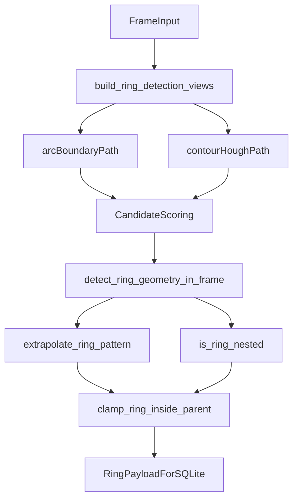

# rings_detector Module

## Block Diagram

## What This Module Does

- Detects ring geometry on minimap frames from mask/contour/arc hypotheses.
- Provides ring timing constants and helpers based on `RING_PHASE_SEQUENCE`.
- Computes expected ring radius in map units from canonical diameters.
- Predicts missing ring geometry from prior rings (`extrapolate_ring_pattern`).
- Validates nesting and clamps child ring radius to stay inside the parent ring.
- Exposes map-context helpers for per-map radius overrides.

## Public Functions

- `set_map_context(map_mp_id)` — sets per-map context for radius helpers.
- `parse_center_json(center_json)` — parses `{x,y,space}` payload to numeric center.
- `ring_phase_duration_seconds(event_type, ring_number)` — returns phase duration from constants.
- `extrapolate_ring_pattern(rings_rows, target_ts_start, expected_radius)` — fallback geometry prediction.
- `ring_radius_meters(ring_number)` — canonical or map-specific ring radius in meters.
- `expected_ring_radius_map_units(ring_number, meters_to_map_units)` — converts expected radius to map units.
- `min_ring_radius_map_units(ring_number, meters_to_map_units)` — minimum allowed radius for ring.
- `is_ring_nested(prev_center_json, prev_radius, center_json, radius)` — strict nested geometry check.
- `clamp_ring_inside_parent(...)` — reduces child radius if it exits parent bounds.
- `ring_minimap_bounds(frame)` — returns minimap ROI bounds.
- `build_ring_detection_views(frame, countdown_zone_mode)` — produces ROI masks and preprocessing views.
- `detect_ring_geometry_in_frame(...)` — main ring detector, returns geometry + confidence.

## Key Constants

- `MAP_ROI_X`, `MAP_ROI_Y`, `MAP_ROI_WIDTH`, `MAP_ROI_HEIGHT`
- `RING_COUNTDOWN_MASK_HSV`
- `RING_DIAMETERS_METERS`
- `RING_PHASE_SEQUENCE`, `RING_PHASE_INDEX`
- `RING_MIN_DIAMETER_BASE_METERS`
- `MAP_RING_RADIUS_MAP_OVERRIDE`
- `MAP_RING_RADIUS_METERS_OVERRIDE`
- `DEFAULT_METERS_TO_MAP_UNITS`
- `RING_RADIUS_TOLERANCE_RATIO`, `RING_RADIUS_TOLERANCE_ABS`
- `NESTED_TOLERANCE_MAP_UNITS`

## Interesting Implementation Details

- Arc-first strategy is used in countdown mode (`arc_only_mode` / `countdown_zone_mode`) to avoid full-mask bias.
- Candidate scoring combines geometry fit error, source priors, expected radius, and center proximity.
- `line_pair` and `radial_boundary` fallbacks recover circles when contour masks are fragmented.
- Dynamic fallback uses predicted geometry when direct ring fit confidence is too low.
- Nested clamp is explicit and deterministic: child radius is reduced before payload persistence.
- Detector stores `_last_map_center` state to stabilize radial fallback seeding across frames.

## Dependencies

- Uses only existing project dependencies: `opencv-python`, `numpy`, and standard library modules.
- No new third-party packages were added for this module extraction.
